# NIO

IO存在一些问题：

- 服务端接收客户端的accept()方法是一个阻塞式方法，该方法会一直阻塞，直到有客户端发来连接。因此，服务端在等待期间（阻塞）会什么也不做，造成资源浪费。
- 如果在高并发环境下（每有一个客户端，服务端就要开辟一个线程），服务端需要通过开辟线程来分别处理各个客户端请求。但是每开辟一个线程 大约会消耗1mb内存，因此在高并发环境下对内存等资源的损耗也是非常大的。

以上可以通过NIO进行优化。

NIO: 

* 什么是NIO

new IO、non blocking io`非阻塞式I/O`  (jdk1.4之后提供的)  ,

* 目的

高效率实现IO技术

* 对比

IO：面向流的操作、阻塞式

NIO：面向通道、非阻塞式

* NIO组成

NIO三个组成： 缓冲区buffer（存放数据）、通道Channel（运输数据、链接数据）、选择器Selector（选择让哪个通道生效）

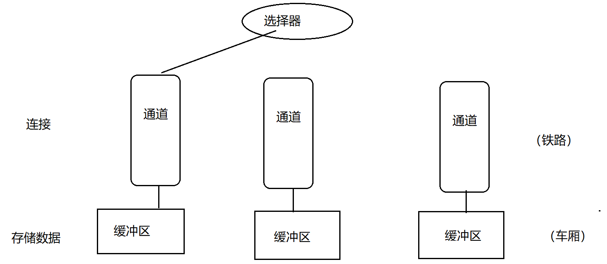

## 缓冲区 （Buffer）

java.nio.Buffer ：本质就是 数组

实现类（7个）：ByteBuffer、ShortBuffer、IntBuffer、LongBuffer、FloatBuffer、DoubleBuffer、CharBuffer（没有BooleanBuffer、StringBuffer）

### ByteBuffer

* 其实就是byte数组

```java
/*
* 五个基本属性
*/
//标记一个位置，当Poistion后移时可以通过reset()回归到此mark的位置
private int mark = -1;
//下一个元素的位置
private int position = 0;
//buffer能够容纳的最大元素个数(limit及之后的位置 不能使用）
private int limit;
//buffer的最大容量（相当于数组的Length），一旦创建后 不能改变
private int capacity;
//堆外内存地址(可以通过jvm操作--操作系统的内存)
long address;
```
* position：下一个读或者写的元素的位置（开始的时候，下一个操作的位置为0，若加了两个元素，则指向第三个）

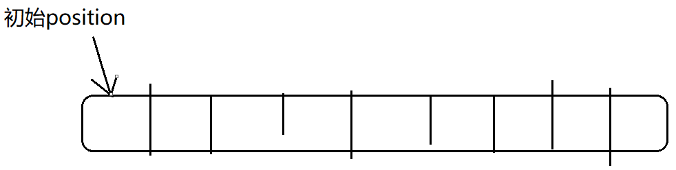


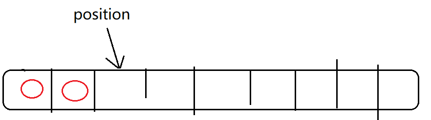


* limit：buffer能够容纳的最大元素个数(limit及之后的位置 不能使用）

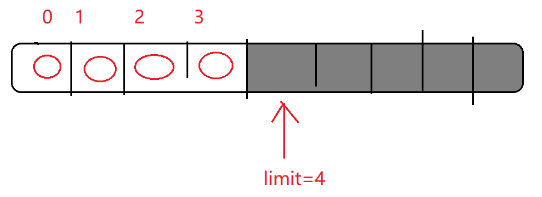

* capacity：buffer的最大容量（相当于数组的Length），一旦创建后 不能改变。


* mark:标记一个位置，当Poistion后移时可以通过reset（）回归到此mark的位置。

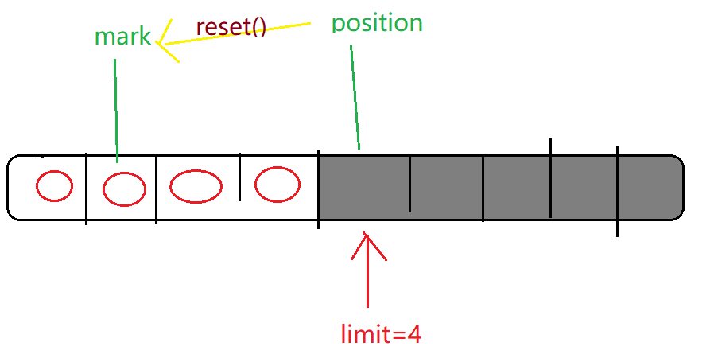

* address: 堆外内存地址

前四个属性的大小关系：

```
mark <= position <= limit <= capacity
```


### Buffer的常见方法

#### flip()

* 源码

```java
//写操作转换为读操作    
public final Buffer flip() {
    	//将position的值给limit（防止有空值）
        limit = position;
        position = 0;
        mark = -1;
        return this;//链式写法.  buffer.flip()的返回值仍然是buffer,可以继续调用buffer的方法buffer.flip().xx()
    }
```

* 实际应用

  **（1）写操作->读操作：flip()**

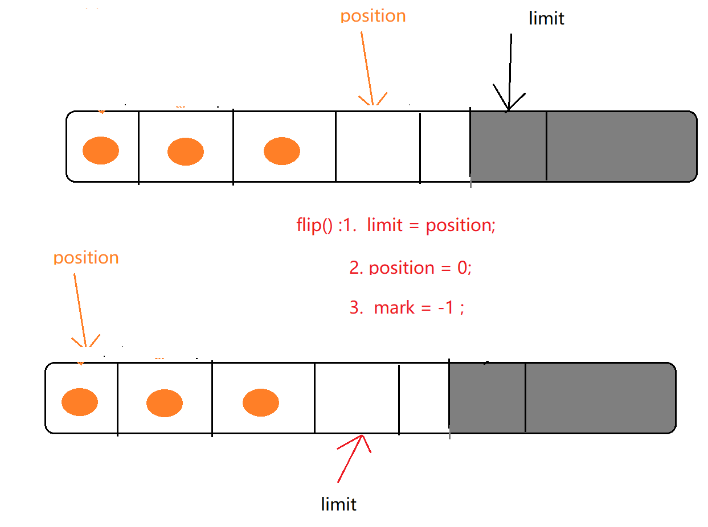

写操作put()                   读操作get()

buffer.put() ;

//写操作->读操作

buffer.flip();

buffer.get()

**（2）/（3）读操作->写操作   /   写操作 -> 写操作：clear()**

* 源码

```java
//重新进行写操作    
public final Buffer clear() {
        position = 0;
        limit = capacity;
        mark = -1;
        return this;
    }

```

> 注意：clear()只是将标记归位，但元素值并没有删除，而是处于一种被“遗忘”的状态

**（4）读->读：rewind()** 

* 源码

```java
//注意rewind()不会改变limit的值,因为本次的操作是“读"到”读"，两次的模式是相同的
public final Buffer rewind() {
        position = 0;
        mark = -1;
        return this;
    }
```

**（5）标记和回退： mark()/reset()**

buffer案例

```java
import java.nio.ByteBuffer;

/*
 * Created by 颜群
 */
public class NIODemo {

    public static  void test1(){
        //相当于new byte[100]，定义buffer大小
        ByteBuffer buffer = ByteBuffer.allocate(100);
        //默认第0个
        System.out.println("position:" + buffer.position());
        //初始跟capacity一样大
        System.out.println("limit:" + buffer.limit());
        //buffer的容量，相当于数组的长度
        System.out.println("capacity（一旦定义不可改变）:" + buffer.capacity());


        //put()写数据
        System.out.println("put()...\n");
        buffer.put("hello".getBytes()   ) ;
        System.out.println("position:" + buffer.position());
        System.out.println("limit:" + buffer.limit());

        //切换模式  写->读：flip()
        System.out.println("flip()...\n");
        buffer.flip() ;
        System.out.println("position:" + buffer.position());
        System.out.println("limit:" + buffer.limit());

        //get()
        System.out.println("get()...\n");
        byte[] bs = new byte[ buffer.limit()];
        buffer.get( bs ) ;

        System.out.println("读取到的数据：" +new String( bs));
        System.out.println("position:" + buffer.position());
        System.out.println("limit:" + buffer.limit());
    }

    public static  void test2(){
        ByteBuffer buffer = ByteBuffer.allocate(8);
        //放数据
        for(int i=0;i<buffer.capacity();i++){
            buffer.put( (byte) i ) ;// 0 1 2 ... 7
        }

        buffer.position(2) ;
        buffer.limit(5);
		//获取原buffer的局部引用（局部范围：position - limit），指向同一个对象
        ByteBuffer sliceBuffer = buffer.slice();
        
        for(int i=0;i<sliceBuffer.capacity();i++)
        {
            byte b = sliceBuffer.get(i);
            b += 100 ;
            sliceBuffer.put(i,b) ;
        }

        buffer.position(0) ;
        buffer.limit(  buffer.capacity())  ;
		//修改的是sliceBuffer 原buffer也跟着修改
        while(buffer.hasRemaining()){ //迭代器
            System.out.println( buffer.get()  );
        }


    }

    public static  void test3(){

        ByteBuffer buffer = ByteBuffer.allocate(100);
        buffer.put("helloworld".getBytes()) ;//position:0 ->10
        buffer.mark();//mark: 10
        System.out.println("position:"+buffer.position());
        System.out.println("mark:"+buffer.mark().position());
        buffer.put("123".getBytes()) ; ////position:10 ->13

        System.out.println("position:"+buffer.position());
        buffer.reset() ;//将position恢复到mark的位置
        System.out.println("position:"+buffer.position());

        byte[] bs = new byte[5] ;
        //从 buffer的position 开始取 三个参数：存放容器(bs是容器)，从容器的第几位开始放，放几位
        buffer.get(bs ,  2 ,3) ;

        System.out.println(bs[0]);
        System.out.println(bs[1]);
        //java 是 unicode 编码 将1转为 ASCII码
        System.out.println(bs[2]);
        System.out.println(bs[3]);
        System.out.println(bs[4]);
        System.out.println( new String(bs));

    }

    public static void main(String[] args) {
//        test1();
//        test2();
        test3();
    }
}

```


```java
    public static void test4(){
        ByteBuffer buffer = ByteBuffer.allocate(100);
        buffer.put("helloworld".getBytes()) ;
        //写->读
        buffer.flip() ;
        byte[] bs = new byte[ buffer.limit()] ;
        buffer.get( bs) ;
        System.out.println(new String(bs)   );

        //读->读
        buffer.rewind() ;
        buffer.get( bs) ;
        System.out.println(new String(bs));

        //clear():并没有真正的删除元素，只是将元素处于一个被 遗忘的状态
        buffer.clear();
        //unicode (ascii)  Java是unicode编码 ascii是unicode的一个子集
        System.out.println(  (char)buffer.get(2) );

    }
```


## Channel 通道

通道负责 对buffer中数据的传输，通道本身不存储数据，只负责对数据的传输。通道是双向的（不同于IO中是单向）

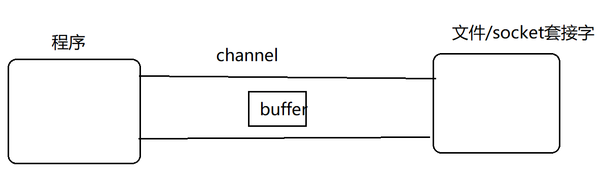


常见获取channel对象的方法：

```
FileChannel.open() -> 获取Channel        FileInputStream/FileOutputStream/RandomAccessFile:getChannel() ;        Socket/ServerSocket/DatagramSocket:getChannel()
```

## 尝试使用 buffer和channel进行 文件复制

### 方式1：使用非直接缓冲区

```java
    //   尝试使用 buffer和channel进行 文件复制
//    使用非直接缓冲区
    public static void test6(){

        long start = System.currentTimeMillis();
        FileInputStream input = null ;
        FileOutputStream out = null ;
        FileChannel inChannel = null ;
        FileChannel outChannel = null ;
        try{

		//非直接缓冲区
        ByteBuffer buffer = ByteBuffer.allocate(1024);

         input = new FileInputStream("d:/mvnrep.rar");
         out = new FileOutputStream("d:/mvnrep2.rar");

         inChannel = input.getChannel();
         outChannel = out.getChannel();

        while(inChannel.read(buffer)  !=-1){//读
            //读到写
            buffer.flip() ;
            outChannel.write(buffer)  ;//写
            //写到读
            buffer.clear() ;
        }
            long end = System.currentTimeMillis();
            System.out.println("复制操作消费时间:" + (end-start));
        }catch (Exception e){
            e.printStackTrace();
        }finally {
            try{
            if(outChannel != null) outChannel.close();
            if(inChannel != null) inChannel.close();
            if(out != null) out.close();
            if(input != null) input.close();
            }catch (Exception e){
                e.printStackTrace();
            }
        }
    }
```

> 复制操作消费时间:4941

### 方式2：使用直接缓冲区 

* （本例代码，不建议使用，这样使用对直接缓冲区的利用率太低。让直接缓冲区发挥真正作用 必须借助于：零拷贝、内存映射等手段，而不能用本代码的方法）

```java
//    使用直接缓冲区 (本代码不建议使用)
    public static void test7(){
        long start = System.currentTimeMillis();
        FileInputStream input = null ;
        FileOutputStream out = null ;
        FileChannel inChannel = null ;
        FileChannel outChannel = null ;
        try{
            //直接缓冲区
            ByteBuffer buffer = ByteBuffer.allocateDirect(1024);

            input = new FileInputStream("d:/mvnrep.rar");
            out = new FileOutputStream("d:/mvnrep3.rar");

            //通过限制，规定channel只能是单向的
            inChannel = input.getChannel();
            outChannel = out.getChannel();

            while(inChannel.read(buffer)  !=-1){//读
                buffer.flip() ;
                outChannel.write(buffer)  ;//写
                buffer.clear() ;
            }
            long end = System.currentTimeMillis();
            System.out.println("复制操作消费时间:" + (end-start));
        }catch (Exception e){
            e.printStackTrace();
        }finally {
            try{
                if(outChannel != null) outChannel.close();
                if(inChannel != null) inChannel.close();
                if(out != null) out.close();
                if(input != null) input.close();
            }catch (Exception e){
                e.printStackTrace();
            }
        }
    }
```

> 复制操作消费时间:4710

* 通过源码可知，DirectByteBuffer就是直接缓冲区（实现类）

~~~java
DirectByteBuffer(int cap) { 
        super(-1, 0, cap, cap);
        boolean pa = VM.isDirectMemoryPageAligned();
        int ps = Bits.pageSize();
        long size = Math.max(1L, (long)cap + (pa ? ps : 0));
        Bits.reserveMemory(size, cap);

        long base = 0;
        try {
            //分配堆外内存，就是jvm以外的内存
            base = unsafe.allocateMemory(size);
        } catch (OutOfMemoryError x) {
            Bits.unreserveMemory(size, cap);
            throw x;
        }
        unsafe.setMemory(base, size, (byte) 0);
        if (pa && (base % ps != 0)) {
            // Round up to page boundary
            address = base + ps - (base & (ps - 1));
        } else {
            address = base;
        }
        cleaner = Cleaner.create(this, new Deallocator(base, size, cap));
        att = null;
    }
~~~


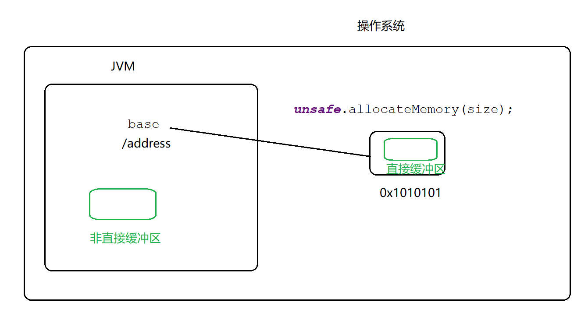

```java
//MappedByteBuffer:内存映射文件（物理映射文件）   DirectBuffer：直接缓冲区
class DirectByteBuffer    extends MappedByteBuffer    implements DirectBuffer
```

## 使用非直接缓冲区、直接缓冲区的流程区别

### 1、使用非直接缓冲区实现：复制

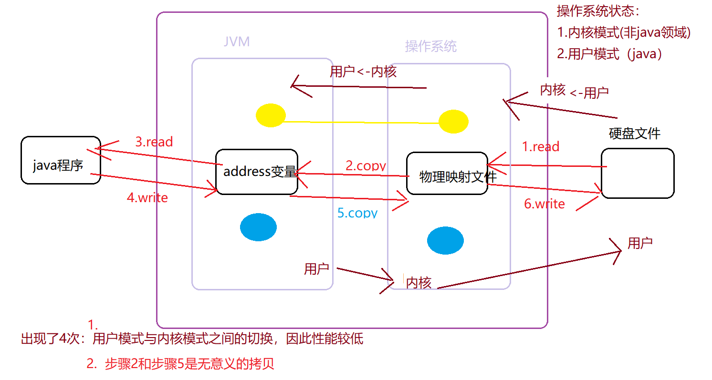

### 2、使用非直接缓冲区实现：复制


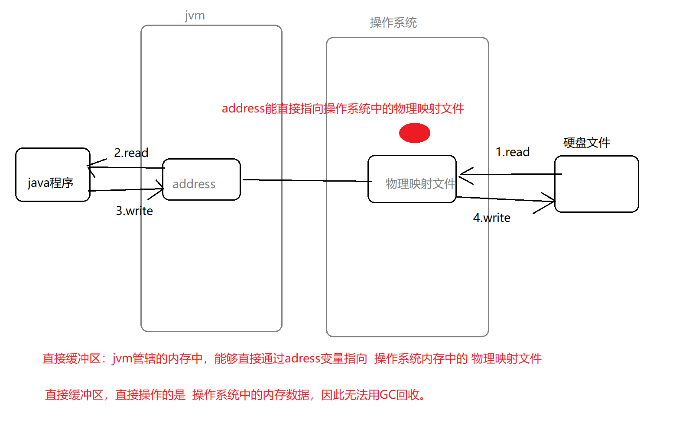

**以上，也称为零拷贝**

#### 实现零拷贝的方式

API层面： 

（1）MappredByteBuffer类（代表物理映射文件）

（2）FileChannel中的 transferFrom()/transferTo()方法来实现零拷贝。

##### MappredByteBuffer类实现

```java
    //   尝试使用 buffer和channel进行 文件复制
	//    使用直接缓冲区(零拷贝)
    public static void test8(){
        long start = System.currentTimeMillis();
        //channel buffer
        try {
            FileChannel inChannel = FileChannel.open(Paths.get("D:/mvnrep.rar") );    
            FileChannel outChannel = FileChannel.open(Paths.get("D:/mvnrep2.rar") , StandardOpenOption.WRITE, StandardOpenOption.READ,StandardOpenOption.CREATE);
            //物理映射文件
            MappedByteBuffer inMappedBuf = inChannel.map(FileChannel.MapMode.READ_ONLY, 0, inChannel.size());
            MappedByteBuffer outMappedBuf = outChannel.map(FileChannel.MapMode.READ_WRITE, 0, inChannel.size());
			//从读通道拿出来--放到输出通道中去
            byte[] st = new byte[  inMappedBuf.limit()  ] ;
            inMappedBuf.get( st);
            outMappedBuf.put( st);
            inChannel.close();
            outChannel.close();
            long end = System.currentTimeMillis();
            System.out.println("直接缓冲区（物理映射文件）,花费时间："+ (end-start));

        }catch(Exception e){
                e.printStackTrace();
         }
    }
```

> 直接缓冲区（物理映射文件）,花费时间：785

###### 扩展：物理映射文件

* 物理映射文件是内存中真实存在的文件，如（a.txt）

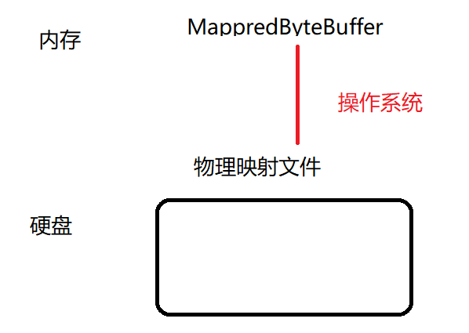


* 只需要修改MappedXxBuffer，操作系统会自动将此对象中的数据同步到硬盘文件中

```java
   public static void test9(){
        try{
            RandomAccessFile raf = new RandomAccessFile( "d:/a.txt","rw") ;
            FileChannel fileChannel = raf.getChannel();
            //只修改内存中的mappedByteBuffer
            MappedByteBuffer mappedByteBuffer  = fileChannel.map( FileChannel.MapMode.READ_WRITE, 0,raf.length());
            mappedByteBuffer.put(1,(byte)'X') ;
            mappedByteBuffer.put(4,(byte)'Y') ;
            //硬盘中的文件会自动修改（操作系统的功能）
            raf.close();
        }catch (Exception e){
            e.printStackTrace();
        }
    }
```

##### 使用FileChannel中的 transferFrom()/transferTo()方法来实现

* 左边往右边送用to，右边到左边拿用from，只用一个就行

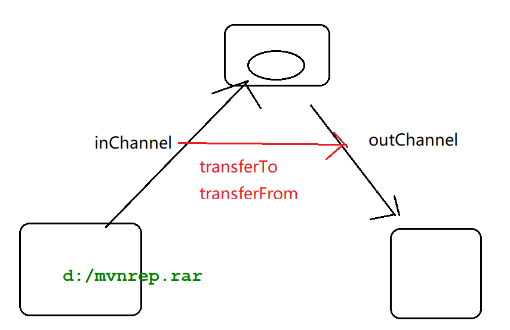

```java
    public static void test10(){
        long start = System.currentTimeMillis();
        try{
            FileChannel inChannel = FileChannel.open(Paths.get("d:/mvnrep.rar"));
            //打开模式（可写、可读、可创建）
            FileChannel outChannel = FileChannel.open( Paths.get("d:/mvnrep2.rar"),StandardOpenOption.WRITE,StandardOpenOption.READ,StandardOpenOption.CREATE );
            //零拷贝
            inChannel.transferTo( 0,inChannel.size(),outChannel ) ;
            //等价于
            //outChannel.transferFrom( 0,outChannel.size(),inChannel ) ;
            inChannel.close();
            outChannel.close();
            long end = System.currentTimeMillis();
            System.out.println("零拷贝时间："+  (end-start));
        }catch (Exception e){
            e.printStackTrace();
        }
    }
}
```

> 零拷贝时间：370

> **提示：零拷贝用到的 transferTo\transferFrom需要依赖于操作系统底层的支持（目前主流的基本都支持）**

## NIO实现文件发送

IO发送文件

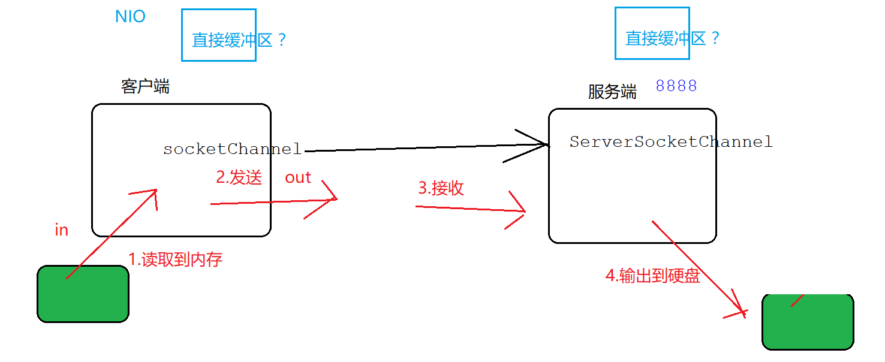

```java

    public static void server() throws Exception {
        //类似于IO技术中的 ServerSocket
        ServerSocketChannel serverSocketChannel = ServerSocketChannel.open();
        serverSocketChannel.bind( new InetSocketAddress(8888)) ;
        SocketChannel sChannel = serverSocketChannel.accept();
        System.out.println("客户端连接成功...");
        ByteBuffer buffer = ByteBuffer.allocate(1024);

        long start = System.currentTimeMillis();
        FileChannel outChannel = FileChannel.open(Paths.get("d:/123.rar"), StandardOpenOption.WRITE, StandardOpenOption.CREATE);

        while(sChannel.read(buffer ) != -1){ //3.接收
            buffer.flip();
            outChannel.write(buffer); //4.输出
            buffer.clear();
        }
        sChannel.close();
        outChannel.close();
        serverSocketChannel.close();
        long end = System.currentTimeMillis();
        System.out.println("接收："+(end-start));


    }

·	//使用非直接缓冲区
    public static void client()  throws Exception {
        long start  = System.currentTimeMillis();
        SocketChannel socketChannel = SocketChannel.open(  new InetSocketAddress( "127.0.0.1" ,8888) );
        FileChannel inFileChannel = FileChannel.open(Paths.get("D:/mvnrep.rar"), StandardOpenOption.READ);
        //buffer+channel
        ByteBuffer buffer = ByteBuffer.allocate(1024);
		//1.往buffer中读取
        while(   inFileChannel.read( buffer )  != -1){
            buffer.rewind() ;
            //2.发送
            socketChannel.write(buffer) ;
            buffer.clear() ;
        }

        if(inFileChannel!= null) inFileChannel.close();
        if(socketChannel!= null) socketChannel.close();
        long end  = System.currentTimeMillis();
        System.out.println("客户端：" + (end-start));

    }
	
	//使用直接缓冲区
	//客户端发送文件，可以感知文件大小，所以用直接缓冲区，但接受文件的服务端无法直接感		知文件大小，因为无法直接开辟出一块合适的直接缓冲区大小
    public static void client2() throws  Exception{
        long start  = System.currentTimeMillis();
        SocketChannel socketChannel = SocketChannel.open(  new InetSocketAddress( "127.0.0.1" ,8888) );
        FileChannel inFileChannel = FileChannel.open(Paths.get("D:/mvnrep.rar"), StandardOpenOption.READ);
        //使用直接缓冲区（零拷贝）
        inFileChannel.transferTo(0,  inFileChannel.size() ,socketChannel  ) ;  // a   transferFrom/transferTo  b
        long end  = System.currentTimeMillis();
        System.out.println("直接缓冲区方式（客户端）发送文件："+(end-start));

        inFileChannel.close();
        socketChannel.close();
    }
```

> 由于直接缓冲区处于JVM以外（在操作系统中内存） ，因此无法被GC及时回收。故，建议只在 那些不经常改变、 持续重用的项目中使用 直接缓冲区

## 选择器

### 传统IO方式的弊端

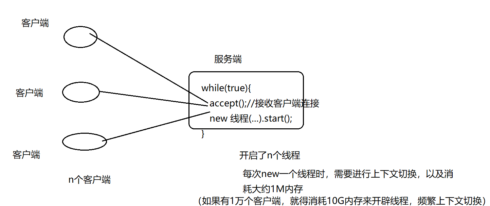


### NIO如何解决传统IO的弊端

NIO如何解决以上 上下文切换、开辟线程内存问题？ 

通过选择器，思路：多个用户可以用 “通道+缓存”  表示，当有多个用户访问时，选择器 可以根据时间，找那些特定（准备就绪）的用户 进行处理。

* **选择器作用：**切换通道；谁准备好，指向谁

### 案例：使用NIO实现“聊天室功能”

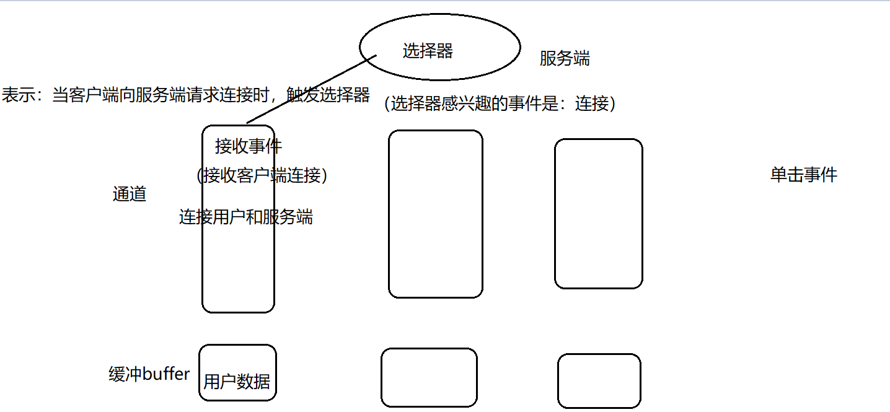


服务端

```java
package chat;

import com.sun.org.apache.bcel.internal.generic.Select;

import java.io.IOException;
import java.net.InetSocketAddress;
import java.net.ServerSocket;
import java.net.Socket;
import java.nio.ByteBuffer;
import java.nio.channels.*;
import java.nio.charset.Charset;
import java.util.HashMap;
import java.util.Iterator;
import java.util.Map;
import java.util.Set;

/*
 * Created by 颜群
 */
public class ChatServer {
    private static Map<String,SocketChannel> clientsMap = new HashMap();
    public static void main(String[] args) throws  Exception {
		//端口迁移，一个端口挂掉，可以选择另外的端口
       int[] ports =  new int[]{7777,8888,9999} ;
       //创建一个选择器
        Selector selector = Selector.open();

        for(int port:ports){
           ServerSocketChannel serverSocketChannel = ServerSocketChannel.open();
            //通道的阻塞模式
           serverSocketChannel.configureBlocking(false) ;
           ServerSocket serverSocket = serverSocketChannel.socket();
           serverSocket.bind(  new InetSocketAddress(port));
            // 标识selector感兴趣的事件：接收客户端连接
           serverSocketChannel.register(selector, SelectionKey.OP_ACCEPT ) ;
       }

        while(true ){
            //一直阻塞，直到选择器上有就绪的事件
            selector.select() ;
            //selectedKeys(): 获取通道和选择器之间的事件 获取选择器对通道的哪些事件感兴趣
            Set<SelectionKey> keys = selector.selectedKeys();
            Iterator<SelectionKey> iterator = keys.iterator();
			//获取所有的事件
            while(iterator.hasNext()){
                //客户端和服务端交互的通道
               SocketChannel clientChannel ;
                //selectedKey:选择器和通道之间的 每一个感兴趣的事件
                SelectionKey selectedKey = iterator.next();
                //连接准备就绪
                if(selectedKey.isAcceptable()) {
                    ServerSocketChannel   channel = (ServerSocketChannel)selectedKey.channel();
                    //连接就绪 的channel
                    clientChannel = channel.accept() ;
                    clientChannel.configureBlocking(false) ;

                    //增加感兴趣的事件：读事件
                    clientChannel.register(selector, SelectionKey.OP_READ   ) ;
                    //给每个用于设置一个 唯一标志符  key(String) -value(SocketChannel)
                    //唯一标志符：是一个 key+四位随机数
                    String key = "key" + (int)(Math.random()*9000 +1000 ) ;
                    clientsMap.put(key, clientChannel ) ;
                }else if(selectedKey .isReadable() ){//读就绪
                    clientChannel =  (SocketChannel) selectedKey.channel() ;
                    ByteBuffer readBuffer = ByteBuffer.allocate(1024);
                    int result =-1 ;
                    String receive = null ;
                    try {
                        result = clientChannel.read(readBuffer);//将客户端发来的数据 存储到readBuffer中
                    }catch (IOException e){//正在读的时候，如果用户退出（断开连接）
                        //谁退出了？key  ,找到 退出的key   map(key, clientChannel )
                        String clientKey = getClientKey(clientChannel  )  ;
                        System.out.println("客户端："+clientKey+"退出聊天室");
                        clientsMap.remove(clientKey) ;
                        clientChannel.close();
                        selectedKey.cancel();
                        continue ;
                    }

                    if(result >0 ){
                        readBuffer.flip() ;
                        Charset charset = Charset.forName("utf-8") ;
                        receive =  String.valueOf(  charset.decode(readBuffer ).array()   ) ;
                        System.out.println(  clientChannel +":"+ receive);

                        if("connecting".equals(receive)){
                            receive = "新客户端上线" ;
                        }

                        //将本次 读通道中的数据，加入到其他通道中
                        selectedKey.attach(receive) ;

                        //感兴趣的事件：写事件
                        selectedKey.interestOps(  SelectionKey.OP_WRITE   )   ;
                    }
                //...
                }else if(selectedKey.isWritable()) {//写数据

                    clientChannel =   (SocketChannel) selectedKey.channel();
                    /*将接收到的消息 广播出去。  例如，张三在聊天室发了一句“hello"，服务端 需要将这个
                    "hello"再广播 所有的聊天室用户  。形式：    张三(key)： hello(SocketChannel)
                    */
                    String key = getClientKey( clientChannel ) ;
                    //广播发送给全部的聊天室用户
                    for(  Map.Entry<String,SocketChannel> entry: clientsMap.entrySet()){
                        SocketChannel eachClient = entry.getValue();//每个用户
                        ByteBuffer broadCastBuffer = ByteBuffer.allocate(1024) ;
                        broadCastBuffer.put((key+":"  + selectedKey.attachment() ).getBytes() ) ;
                        broadCastBuffer.flip() ;
                        eachClient.write( broadCastBuffer ) ;
                    }

                    selectedKey.interestOps(SelectionKey.OP_READ);

                }else{
                    System.out.println("other...");
                }
            }
            keys.clear();
        }
    }


    public static String getClientKey(SocketChannel  clientChannel  ){
        String key = null ;
        //n个人，n个clientChannel
        /*
                key1  :n个clientChannel-1
                key2  :n个clientChannel-2
                key13  :n个clientChannel-3
         */
        Set<Map.Entry<String, SocketChannel>> entries = clientsMap.entrySet();
        for( Map.Entry<String,SocketChannel> entry:entries){
            if(entry.getValue() ==clientChannel ){
                key = entry.getKey() ;
                break ;
            }
        }
        return key;
    }
}

```

客户端

```java
package manybuffers;

import java.io.BufferedReader;
import java.io.InputStreamReader;
import java.net.InetSocketAddress;
import java.nio.ByteBuffer;
import java.nio.channels.SelectionKey;
import java.nio.channels.Selector;
import java.nio.channels.SocketChannel;
import java.util.Iterator;
import java.util.Set;

/*
 * Created by 颜群
 */
public class ChatClient {
    public static void main(String[] args) {
        try {
            SocketChannel socketChannel = SocketChannel.open();
            socketChannel.configureBlocking(false);
            Selector selector = Selector.open();
            //注册“连接事件”
            socketChannel.register(selector, SelectionKey.OP_CONNECT);

            int[] ports = {7777, 8888, 9999};
            int port = ports[(int) (Math.random() * 3)];
            socketChannel.connect(new InetSocketAddress("127.0.0.1", port));

            while (true) {
                selector.select();
                //selectionKeys：包含了所有的事件
                Set<SelectionKey> selectionKeys = selector.selectedKeys();
				//用迭代器将事件迭代
                Iterator<SelectionKey> keyIterator = selectionKeys.iterator();
                while (keyIterator.hasNext()) {

                    SelectionKey selectionKey = keyIterator.next();//每个事件
                    //真实的发生“连接事件”
                    if (selectionKey.isConnectable()) { //连接完毕？接收（读）、发送（写）
                        //buffer  + channel
                        ByteBuffer sendBuffer = ByteBuffer.allocate(1024);
                        SocketChannel clientChannel = (SocketChannel) selectionKey.channel();


                        if (clientChannel.isConnectionPending()) {//正在连接

                            if (clientChannel.finishConnect()) {
                                System.out.println("连接服务端成功,连接的端口是：" + port);
                                //向服务端 发送一条测试数据
                                sendBuffer.put("connecting".getBytes());
                                sendBuffer.flip();
                                clientChannel.write(sendBuffer);
                            }
                        }
                        //在客户端看来，“写操作”不需要注册到通道中，再去使用?

                        //客户端，每次写操作，创建一个线程
                        new Thread(() -> {
                            while (true) {
                                try {
                                    //写--写：需要clear一下
                                    sendBuffer.clear();
                                    //写数据： 接收用户从控制台输入的内容
                                    InputStreamReader reader = new InputStreamReader(System.in);
                                    BufferedReader bReader = new BufferedReader(reader);
                                    String message = bReader.readLine();

                                    sendBuffer.put(message.getBytes());
                                    sendBuffer.flip();
                                    clientChannel.write(sendBuffer);

                                    //发送数据
                                } catch (Exception e) {
                                    e.printStackTrace();
                                }
                            }
                        }).start();


                        //发送数据（写）
                        clientChannel.register(selector, SelectionKey.OP_READ);
                    } else if (selectionKey.isReadable()) {//读
                        ByteBuffer readBuffer = ByteBuffer.allocate(1024);
                        SocketChannel clientChannel = (SocketChannel) selectionKey.channel();
                        int len = clientChannel.read(readBuffer);//读
                        if (len > 0) {
                            String receive = new String(readBuffer.array(), 0, len);
                            System.out.println(receive);
                        }
                    }
                }

                selectionKeys.clear();
            }
        } catch (Exception e) {
            e.printStackTrace();
        }
    }
}

```

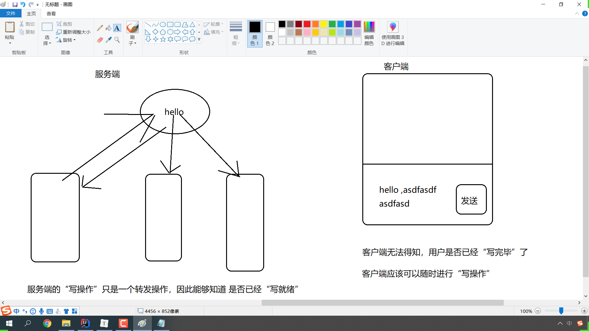


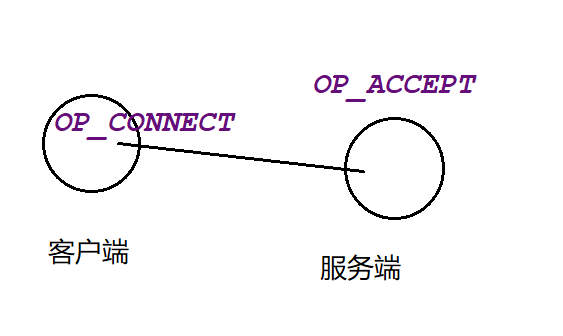

### 用同一个channel读取多个缓冲区

* 之前都是一个通道对应一个缓冲区，现在一个通道对应多个缓冲区

* 注意：如果有2个缓冲区a\b； 先把a读满，再去读取b

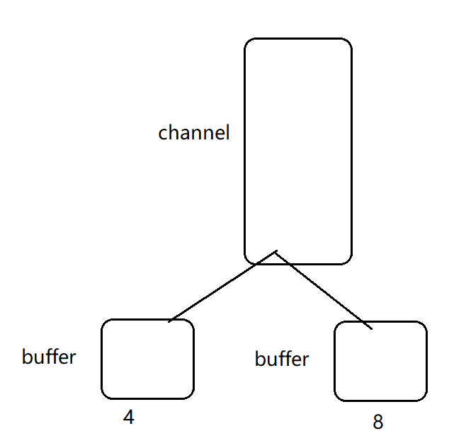

```java
package manybuffers;

import java.net.InetSocketAddress;
import java.net.ServerSocket;
import java.nio.ByteBuffer;
import java.nio.channels.ServerSocketChannel;
import java.nio.channels.SocketChannel;

/*
 * Created by 颜群
 */
public class NIOServer {
    public static void main(String[] args) throws  Exception{
        ServerSocketChannel serverSocketChannel = ServerSocketChannel.open();
        ServerSocket serverSocket = serverSocketChannel.socket();
        serverSocket.bind( new InetSocketAddress(8888)) ;
        //定义两个缓冲区，接受客户端的数据
        ByteBuffer[] buffers = new ByteBuffer[2] ;
        //一个容量为4
        buffers[0] = ByteBuffer.allocate(4) ;
        //一个容量为8
        buffers[1] = ByteBuffer.allocate(8) ;
        int bufferSize = 4 + 8 ;//总容量

        SocketChannel socketChannel = serverSocketChannel.accept();
        System.out.println("服务端：接收到客户端连接。。。");
        while(true){//接收数据
            int totalRead = 0 ;//每一次实际使用
            //如果buffer没满，继续读
            while(totalRead < bufferSize){
                long read = socketChannel.read(buffers);
                totalRead += read ;
                System.out.println("【每一次】，实际读取到的数据大小："+read);
//                System.out.println("实际读取到的【总数据】大小："+totalRead);
            }
            //如果buffer已满， flip() ;
            for(ByteBuffer buffer:buffers){
                buffer.flip() ;
            }
        }

    }
}
```

客户端沿用之前的client

buffer1： 4
buffer2:	8
服务端buffers：共12


客户端发送： 10 ，11(2+9) +   4(3xxxx+1)	

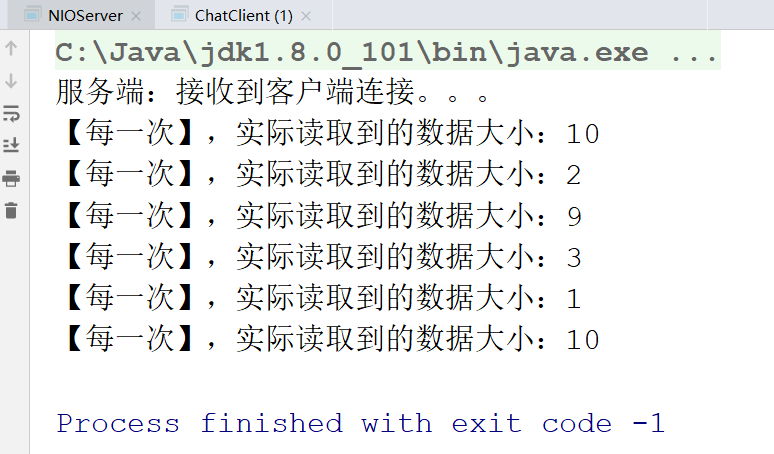

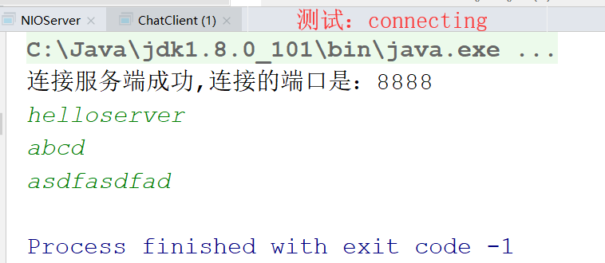