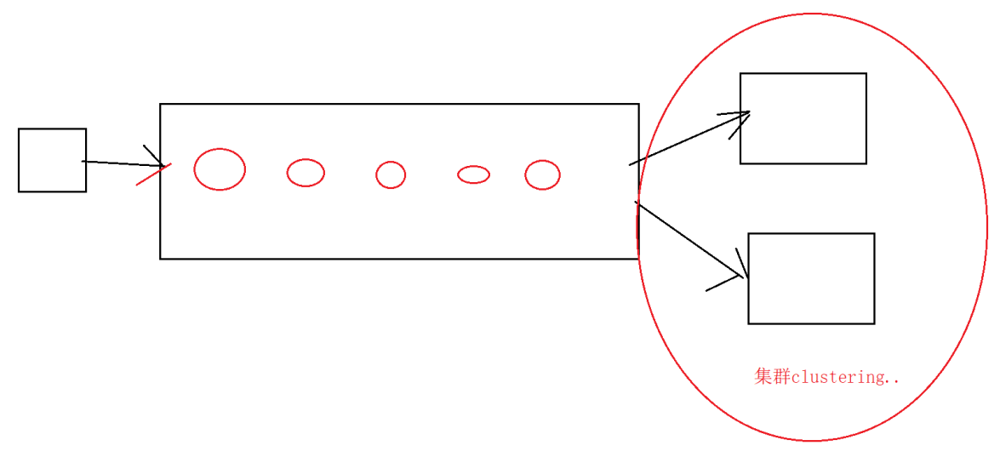
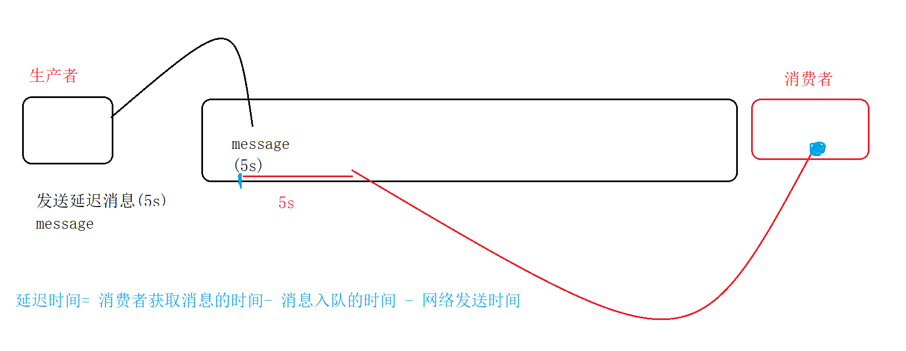
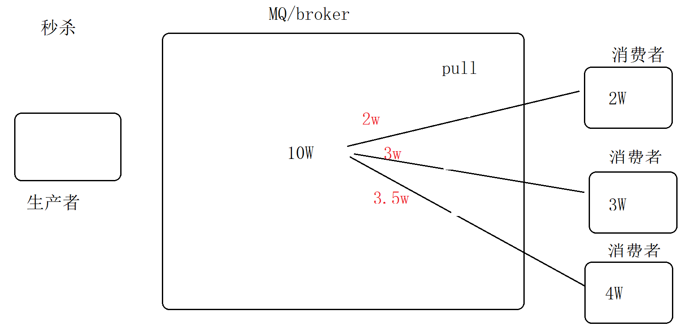
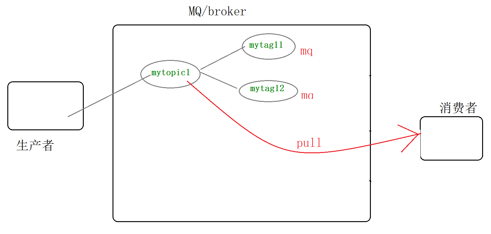
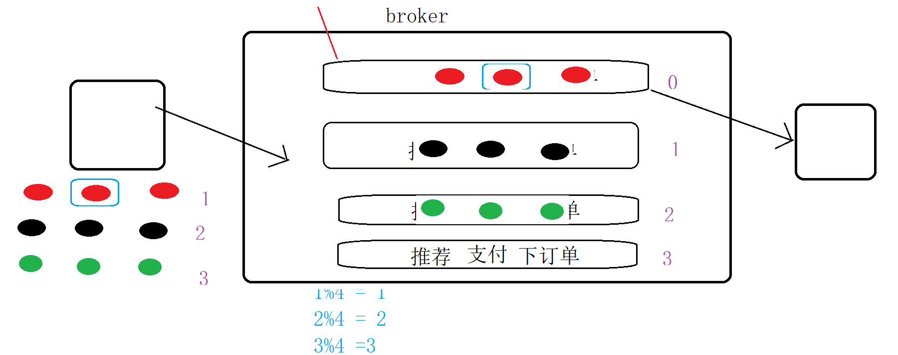
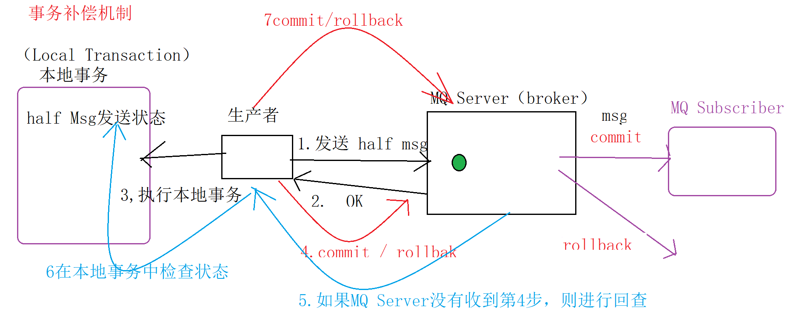
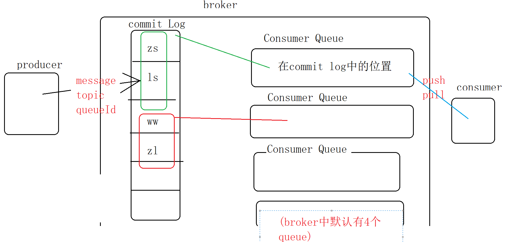

# 消息队列（Message Queue）

## 消息队列作用

### 削峰填谷

秒杀，可以将峰值的流量转移到其他地方（谷）

### 解耦合

生产者和消费者可以通过mq解耦合

生产者-mq-消费者

### 异步消息

生产者-mq-消费者

## 主流MQ产品

**所支持的协议：**AMQP （Advanced Message QUeuing Protocol，高级消息队列协议） 、XMPP、SMTP、 STMP

### ActiveMQ

 apache ,多种协议（AMQP，MQTT，OpenWire，Stomp） , java，将数据直接持久化到数据库中，可靠性较低

### RabbitMQ

 基于AMQP ，运行Erlang语言，性能高，高并发，可靠性高

### Kafaka

linkedin开源MQ，完全分布式架构，高吞吐量（单机10w/s） ，设计之初是为了处理日志 ， 大量数据的数据收集业务

### RocketMQ

阿里巴巴->Apache，,双十一，Java/C++/go语言，支持多协议(AMQP,XMPP,STMP,STOP）,分布式易扩展，亿级消息堆积能力（单机1万以上持久化队列）

### 其他MQ

Redis , ZeroMQ

# RocketMQ

## 角色

- Producer：生产者
- Consumer：消费者
  - PushConsumer：Broker主动将消息推给消费者
  - PullConsumer：消费者请求Broker将消息发送给我（拉）
- Broker：MQ消息服务
- ProducerGroup： 生产者集合
- ConsumerGroup：消费者集合

## 搭建RoketMQ环境

<<<<<<< HEAD
### 部署环境

centos7 :  192.168.2.128   root/root   

### 下载
=======
#### 部署环境

centos7 :  192.168.2.128   root/root   

#### 下载
>>>>>>> d103f642ee61191ed0ca60606a9c130efcb664de

http://rocketmq.apache.org/release_notes/release-notes-4.4.0/  ：binary

上传到centos7中

<<<<<<< HEAD
### 解压
=======
#### 解压
>>>>>>> d103f642ee61191ed0ca60606a9c130efcb664de

tar -zxvf    XXX.tar.gz（gz结尾用这个命令）

unzip Xxx.zip（zip结尾用这个命令）

<<<<<<< HEAD

### 配置master

nameserver: 协调多个rocketmq

master : rocketmq主节点

#### 域名映射
=======
#### 配置

nameserver：协调多个rocketmq

master（多个MQ中的老大）: rocketmq主节点

**--配置master开始--**

* 域名映射
>>>>>>> d103f642ee61191ed0ca60606a9c130efcb664de

vi /etc/hosts

192.168.2.128 mqnameserver1
192.168.2.128 mqmaster1

<<<<<<< HEAD
#### 存储路径 

在rocketmq文件夹下

mkdir mqstore4.4

mkdir mqstore4.4/commitlog

mkdir mqstore4.4/consumequeue

mkdir mqstore4.4/index

#### 配置消息队列broker
=======
* 存储路径

如果MQ中的数据持久化，往哪里存储

文件放在MQ解压文件中

mkdir mqstore

mkdir mqstore/commitlog（提交日志，日志信息）

mkdir mqstore/consumequeue（消费队列）

mkdir mqstore/index（索引值）

* 配置消息队列（broker）
>>>>>>> d103f642ee61191ed0ca60606a9c130efcb664de

文件所在路径：/usr/rocketmq/conf

**2m-2s-async（文件夹）：**2m   两个master , 2s 两个slaver  ,async：异步

<<<<<<< HEAD
配置单机版： broker-a.properties :

brokerId：   0表示master              >0 表示slaver
=======
**配置单机版： broker-a.properties** 

brokerId：0表示master 	 >0表示slaver
>>>>>>> d103f642ee61191ed0ca60606a9c130efcb664de

全部内容

```
//集群的名字
brokerClusterName=DefaultCluster
//当前消息队列的名字
brokerName=broker-a
//brokerId：0表示master 	 >0表示slaver
brokerId=0
deleteWhen=04
fileReservedTime=48
brokerRole=ASYNC_MASTER
flushDiskType=ASYNC_FLUSH
//服务地址
namesrvAddr=mqnameserver1:9876
//默认主题数量
defaultTopicQueueNums=4
//某一个主题不存在，是否允许消息队列自动创建
autoCreateTopicEnable=true
//监听端口（对外访问的端口）
listenPort=10911
//不用的文件删除时间
deleteWhen=04
//文件至少保留48小时
fileReservedTime=48
//存储路径
storePathRootDir=/usr/rocketmq4.4/mqstore
storePathCommitLog=/usr/rocketmq4.4/mqstore/commitlog
storePathConsuQueue=/usr/rocketmq4.4/mqstore/consumequeue
storePathIndex=/usr/rocketmq4.4/mqstore/index
//每次传输消息的最大值（单位字节）--2的16次方
maxMessageSize=65536
//主到从是同步还是异步
brokerRole=ASYNC_MASTER
//队列到硬盘
flushDiskType=ASYNC_FLUSH
```

<<<<<<< HEAD
#### 配置日志

一次性的将 所有xml中的 ${user.home} 替换为/usr/rocketmq

sed -i 's#${user.home}#/usr/rocketmq#g'  *.xml

#### 修改启动参数

将bin/runbroker.sh      runserver.sh ：

JAVA_OPT="${JAVA_OPT} -server -Xms1g -Xmx1g -Xmn1g 

#### 启动Namesrv

bin中： nohup sh mqnamesrv &

**配置日志：**

在MQ文件夹下

mkdir logs

一次性的将所有xml中的 ${user.home} 替换为/usr/rocketmq4.4

sed -i 's#${user.home}#/usr/rocketmq4.4#g'  *.xml

**设置启动参数：**

将bin/runbroker.sh      runserver.sh ：中要求的启动参数修改

JAVA_OPT="${JAVA_OPT} -server -Xms1g -Xmx1g -Xmn1g 

**启动Namesrv：**

在bin中后台启动： nohup sh mqnamesrv &

**查看进程：**

NamesrvStartup 说明启动Namesrv成功

#### 启动BrokerServer

nohup sh mqbroker -c /usr/rocketmq/conf/2m-2s-async/broker-a.properties &

查看进程：

BrokerStartup  说明broker启动成功

## 控制台（Web界面）

### 下载

https://github.com/apache/rocketmq-externals

### 解压缩

#### 在idea中跑控制台

1、导入工程，将zip下的rocket-console导入idea

2、修改idea的maven配置，改为自己本地配置的maven

**maven加速**

阿里云加速

在本地maven的配置文件settings.xml中 加入以下：

```java
<mirror>  
      <id>alimaven</id>  
      <name>aliyun maven</name>  
      <url>http://maven.aliyun.com/nexus/content/groups/public/</url>  		 <mirrorOf>central</mirrorOf>          
</mirror>
```

3、在application.properties中配置 mq服务地址

```java
rocketmq.config.namesrvAddr=192.168.2.128:9876
```

4、可以将源码中的jdk版本从1.7换成1.8

5、批量删除 maven下载失败的jar：for /r %i in (*.lastUpdated) do del %i

#### 将控制台代码打成jar，然后跑jar包

**打成jar：**

mvn clean package -Dmaven.test.skip=true

**执行：**

java -jar   jar包名字.jar

## 创建mq工程（Springboot工程）

### 依赖配置

pom.xml

```java
<?xml version="1.0" encoding="UTF-8"?>
<project xmlns="http://maven.apache.org/POM/4.0.0"
         xmlns:xsi="http://www.w3.org/2001/XMLSchema-instance"
         xsi:schemaLocation="http://maven.apache.org/POM/4.0.0 http://maven.apache.org/xsd/maven-4.0.0.xsd">
    <modelVersion>4.0.0</modelVersion>
    <parent>
        <groupId>org.springframework.boot</groupId>
        <artifactId>spring-boot-starter-parent</artifactId>
        <version>2.1.3.RELEASE</version>
    </parent>

    <groupId>com.yanqun</groupId>
    <artifactId>MyRocketMQ</artifactId>
    <version>1.0-SNAPSHOT</version>
    <properties>
        <project.build.sourceEncoding>UTF-8</project.build.sourceEncoding>
        <java.version>1.8</java.version>
        <guava.version>16.0.1</guava.version>
        <commons-digester.version>2.1</commons-digester.version>
        <commons-lang.version>2.6</commons-lang.version>
        <commons-io.version>2.4</commons-io.version>
        <commons-cli.version>1.2</commons-cli.version>
        <rocketmq.version>4.4.0</rocketmq.version>
        <surefire.version>2.19.1</surefire.version>
        <aspectj.version>1.6.11</aspectj.version>
        <main.basedir>${basedir}/../..</main.basedir>
        <docker.image.prefix>styletang</docker.image.prefix>
    </properties>

    <dependencies>
        <dependency>
            <groupId>org.springframework.boot</groupId>
            <artifactId>spring-boot-starter-web</artifactId>
        </dependency>
        <dependency>
            <groupId>org.springframework.boot</groupId>
            <artifactId>spring-boot-starter-actuator</artifactId>
        </dependency>
        <dependency>
            <groupId>org.springframework.boot</groupId>
            <artifactId>spring-boot-starter-test</artifactId>
            <scope>test</scope>
        </dependency>
        <dependency>
            <groupId>commons-collections</groupId>
            <artifactId>commons-collections</artifactId>
            <version>3.2.2</version>
        </dependency>
        <dependency>
            <groupId>org.apache.rocketmq</groupId>
            <artifactId>rocketmq-client</artifactId>
            <version>${rocketmq.version}</version>
        </dependency>
    </dependencies>
</project>
```

#### 批量删除下载失败的依赖包

批量删除 maven下载失败的jar【进maven本地仓库，敲cmd，执行这句话】：for /r %i in (*.lastUpdated) do del %i

### 第一个MQ程序

~~~java
public class CONST {
    public static final String NAMESERVER_ADDR = "192.168.2.128:9876" ;
}
~~~

#### 服务器地址代码

```
public class CONST {
    public static final String NAMESERVER_ADDR = "192.168.2.128:9876" ;
}
```

#### 生产者代码

```java
package com.yanqun.producer;

import com.yanqun.api.CONST;
import org.apache.rocketmq.client.exception.MQBrokerException;
import org.apache.rocketmq.client.exception.MQClientException;
import org.apache.rocketmq.client.producer.DefaultMQProducer;
import org.apache.rocketmq.client.producer.SendResult;
import org.apache.rocketmq.common.message.Message;
import org.apache.rocketmq.remoting.exception.RemotingException;

public class MyProducer {

    public static void main(String[] args) {
        //创建生产者
        DefaultMQProducer producer = new DefaultMQProducer("myProducer");
        producer.setNamesrvAddr(CONST.NAMESERVER_ADDR);
        try {
            producer.start(); //启动生产者
        } catch (MQClientException e) {
            e.printStackTrace();
        }
        //生产消息（生产主题和数据）
        for(int i=0;i<10;i++){
            /*
                    topic:主题（一级目录）
                    tags:标签（二级目录）
                    keys + body :  以key-value的形式存放内容
             */
            Message message = new Message("mytopic1","mytag11", "key"+i,("mymq"+i) .getBytes());
            //生产者发送消息
            try {
                SendResult result = producer.send(message);
                System.out.println("发送成功："+ result);
            } catch (MQClientException e) {
                e.printStackTrace();
            } catch (RemotingException e) {
                e.printStackTrace();
            } catch (MQBrokerException e) {
                e.printStackTrace();
            } catch (InterruptedException e) {
                e.printStackTrace();
            }
        }
        producer.shutdown();
    }
}
```

#### 消费者代码

```java
package com.yanqun.comsumer;

import com.yanqun.api.CONST;
import org.apache.rocketmq.client.consumer.DefaultMQPushConsumer;
import org.apache.rocketmq.client.consumer.listener.ConsumeConcurrentlyContext;
import org.apache.rocketmq.client.consumer.listener.ConsumeConcurrentlyStatus;
import org.apache.rocketmq.client.consumer.listener.MessageListenerConcurrently;
import org.apache.rocketmq.client.exception.MQClientException;
import org.apache.rocketmq.common.consumer.ConsumeFromWhere;
import org.apache.rocketmq.common.message.MessageExt;
import org.apache.rocketmq.remoting.common.RemotingHelper;

import java.io.UnsupportedEncodingException;
import java.util.List;

public class MyConsumer {
    public static void main(String[] args) {
        DefaultMQPushConsumer consumer = new DefaultMQPushConsumer("myConsumer");
        consumer.setNamesrvAddr(CONST.NAMESERVER_ADDR);
		//从上一次消费完的地方取
        consumer.setConsumeFromWhere( ConsumeFromWhere.CONSUME_FROM_LAST_OFFSET );
        try {
            //从哪个主题消费
            consumer.subscribe("mytopic1","*");
            //设置监听器：当生产者生产数据时，将数据推送给 消费者
            consumer.registerMessageListener(new MessageListenerConcurrently() {
                @Override
                public ConsumeConcurrentlyStatus consumeMessage(List<MessageExt> list, ConsumeConcurrentlyContext consumeConcurrentlyContext) {
                    //一个一个消费，每次拿队列中的第0个
                    MessageExt messageExt = list.get(0) ;
                    String topic = messageExt.getTopic();
                    String tags = messageExt.getTags();
                    String keys = messageExt.getKeys();
                    try {
                        String body =   new String(  messageExt.getBody(), RemotingHelper.DEFAULT_CHARSET);
                        System.out.println("消费："+topic+ "，\t"+tags+ "，\t"+keys+ "，\t"+body);
                    } catch (UnsupportedEncodingException e) {
                        e.printStackTrace();
                    }
                    //此条消息消费成功，继续下一个...
                    return  ConsumeConcurrentlyStatus.CONSUME_SUCCESS;
                }
            });
			//启动消费者
            consumer.start();
        } catch (MQClientException e) {
            e.printStackTrace();
        }

    }
}
```

#### 异常问题

如果在控制台查询消息时 topic无反应（或者报错desc208） ，原因是rocketmq内部问题（ac认证问题）

## mq集群：主从同步

**作用：**将mater中的数据自动备份到slaver中，一旦master挂掉，slaver可以支持继续提供数据		

### 将master关闭

在mq的bin目录下：

[root@bigdata01 bin]# ./mqshutdown broker

[root@bigdata01 bin]# ./mqshutdown namesrv

### 配置slaver

#### 域名映射

主从节点都要这样配置

vi /etc/hosts

192.168.2.128 mqnameserver1
192.168.2.128 mqmaster1

192.168.2.129 mqnameserver2
192.168.2.129 mqmaster1slaver1

#### 将master节点上的mq远程复制到slaver节点上

scp -r rocketmq/ root@192.168.2.129:/usr/

/usr/rocketmq/conf/2m-2s-async/ broker-a.properties :

#### 需要修改内容

```java
brokerId=0
rokerRole=ASYNC_MASTER
namesrvAddr=mqnameserver1:9876;mqnameserver2:9876
```

broker-a-s.properties :

```java
brokerClusterName=DefaultCluster
brokerName=broker-a
brokerId=1
deleteWhen=04
fileReservedTime=48
brokerRole=SLAVE
flushDiskType=ASYNC_FLUSH
namesrvAddr=mqnameserver1:9876;mqnameserver2:9876
defaultTopicQueueNums=4
autoCreateTopicEnable=true
listenPort=10911
deleteWhen=04
fileReservedTime=48
storePathRootDir=/usr/rocketmq/mqstore
storePathCommitLog=/usr/rocketmq/mqstore/commitlog
storePathConsuQueue=/usr/rocketmq/mqstore/consumequeue
storePathIndex=/usr/rocketmq/mqstore/index
maxMessageSize=65536
flushDiskType=ASYNC_FLUSH
```

#### 问题

master: 主配置文件、从配置文件

slaver:主配置文件、从配置文件

> 这样做的目的是为了方便维护

### 启动

启动master-slaver

#### 先启动master

先启动master（192.168.2.128中启动）

启动Namesrv：

bin中： nohup sh mqnamesrv &

启动BrokerServer:

nohup sh mqbroker -c /usr/rocketmq/conf/2m-2s-async/broker-a.properties &

#### 再启动slaver

再启动slaver（192.168.2.129中启动）

bin中： nohup sh mqnamesrv &

nohup sh mqbroker -c /usr/rocketmq/conf/2m-2s-async/broker-a-s.properties  &

### 修改项目配置文件

修改项目的namersrv地址

```
rocketmq.config.namesrvAddr=192.168.2.128:9876;192.168.2.129:9876
```

### 启动客户端

#### 验证主从

挂掉master, 查看能否从slaver中取数据

一般： 向Master中写数据，从slaver中读数据

挂掉kill -9 进程号

可以发现，当mater挂掉后，仍然可以从slaver中消费数据

## 发送消息的类型

### 异步

```java
//2发送异步消息
/*
  发送异步消息之后：有2个线程：a.Main线程，发送完毕立刻执行以后的程序；
  b.处理消息的线程，并在处理完毕后触发回调函数
  onSuccess（）\onException()
*/
producer.send(message, new SendCallback() {
    @Override
    public void onSuccess(SendResult sendResult) {
        System.out.println("发送成功："+sendResult);
    }
    @Override
    public void onException(Throwable throwable) {
        System.out.println("发送失败，异常："+ throwable.getMessage());
    }
}); 
```

### 同步

```java
 SendResult result = producer.send(message);
//System.out.println("发送成功："+ result);
```

### 单向发送

```java
 producer.sendOneway(message);//只发送，不接收返回值，不可靠的消息；不重要的数据，日志
```

## Push Consumer消费模式

### 默认集群模式

```java
consumer.setMessageModel(MessageModel.CLUSTERING);
```

#### 搭建消费者集群

只需要将groupName设置相同即可



### 延迟消息

不支持任意的时间精度，只支持几下几种

默认配置，/usr/rocketmq/conf/broker.conf（默认配置）

messageDelayLevel = 1s 5s 10s 30s 1m 2m 3m 4m 5m 6m 7m 8m 9m 10m 20m 30m 1h 2h

定义：生产者立刻将消息发送到队列， 在队列中停留一些时间后 发送给消费者



```java
message.setDelayTimeLevel(3);
```

### 广播模式

特点：最大的不同，将全部的消息内容，给每个消费者各一份（每个消费者 拥有一套完整的 消息数据）

不需groupName相同

设置成广播模式：消费者

```java
        //设置成广播模式
        consumer.setMessageModel(MessageModel.BROADCASTING) ;
```

设置订阅标签

```java
 consumer.subscribe("mytopic1","tag1");
 consumer.subscribe("mytopic1","*");
 consumer.subscribe("mytopic1","tag1||tag2");
```


###  偏移量Offset

offset是消费的进度，指向某个topic中 下一条数据在队列中存放的位置

offset存储在哪里？本地存储（消费者的服务器）、远程存储（存放mq的服务器）？都有

- 集群模式：（远程存储）负载均衡，每个消费者 只消费一部分数据。 因为各个消费者 需要通过一个共同的指针offset 来指定每次消费的位置，因此此时 offset就需要存放在远程（队列服务器中）
- 广播模式：（本地存储）因为广播模式下 每个消费者 都需要一套完整的 消息数据，因此每个消费者就需要使用一个指针offset来维护 当前消费的位置。

API层面：

远程存储：RemoteBrokerOffsetStore

本地存储 ：LocalFileOffsetStore

二者的共同父类：OffsetStore

## Pull Consumer消费模式






pull方式一

```java
package com.yanqun.pull;

import com.yanqun.api.CONST;
import org.apache.rocketmq.client.consumer.DefaultMQPullConsumer;
import org.apache.rocketmq.client.consumer.PullResult;
import org.apache.rocketmq.client.consumer.PullStatus;
import org.apache.rocketmq.common.consumer.ConsumeFromWhere;
import org.apache.rocketmq.common.message.MessageExt;
import org.apache.rocketmq.common.message.MessageQueue;

import java.util.HashMap;
import java.util.List;
import java.util.Set;

public class PullConsumer {

    private static HashMap<MessageQueue ,Long> offset = new HashMap<>();
    public static void main(String[] args) throws Exception {

        String groupName = "pullGroup" ;
        DefaultMQPullConsumer consumer = new DefaultMQPullConsumer(groupName );
        consumer.setNamesrvAddr(CONST.NAMESERVER_ADDR);
        consumer.start();

        System.out.println("pull consumer start...");

        Set<MessageQueue> mqs = consumer.fetchSubscribeMessageQueues("mytopic1");
        for(MessageQueue mq : mqs){
            //分别获取每个mq中的数据
            while(true){
                //pullBlockIfNotFound: 1队列  2null  3偏移量  4每次最多pull消息的个数
                PullResult pullResult = consumer.pullBlockIfNotFound(mq, null, getOffset(mq), 2);
                System.out.println(pullResult);
                //当消费pull了若个干消息之后，需要重新设置偏移量
                setOffset(mq, pullResult.getNextBeginOffset()) ;

                //有数据
                if(  pullResult.getPullStatus()== PullStatus.FOUND ){
                    List<MessageExt> messages = pullResult.getMsgFoundList();
                    for(MessageExt message :messages){
                        System.out.println(message);
                    }
                }else if(pullResult.getPullStatus()== PullStatus.NO_MATCHED_MSG ){
                    break ;
                }else{
                    System.out.println("error...");
                }

            }
        }
        consumer.shutdown();
    }

    //获取某个mq的偏移量
    private static long getOffset(MessageQueue mq){
        return  offset.get(mq) == null ? 0 : offset.get(mq);
    }
    private static void setOffset(MessageQueue mq,long mqoffset){
        offset.put(mq,mqoffset);

    }

}

```

pull方式二（时间调度：每隔3秒主动拉去一次数据）

```java
package com.yanqun.pull;

import com.yanqun.api.CONST;
import org.apache.rocketmq.client.consumer.*;
import org.apache.rocketmq.common.message.MessageExt;
import org.apache.rocketmq.common.message.MessageQueue;
import org.apache.rocketmq.common.protocol.heartbeat.MessageModel;

import java.util.HashMap;
import java.util.List;
import java.util.Set;

public class PullConsumerSchedule {

    private static HashMap<MessageQueue ,Long> offset = new HashMap<>();
    public static void main(String[] args) throws Exception {

        String groupName = "pullGroup" ;

        MQPullConsumerScheduleService consumerService = new MQPullConsumerScheduleService("pullGroup" );
        consumerService.getDefaultMQPullConsumer().setNamesrvAddr(CONST.NAMESERVER_ADDR);
        consumerService.setMessageModel(MessageModel.CLUSTERING);
//        consumerService.setNamesrvAddr(CONST.NAMESERVER_ADDR);
//        consumerService.start();

        System.out.println("pull consumerService start...");

        consumerService.registerPullTaskCallback("mytopic1" ,new PullTaskCallback(){//匿名内部类
            @Override
            public void doPullTask(MessageQueue mq, PullTaskContext pullTaskContext) {
                System.out.println("----" + mq.getQueueId());
                MQPullConsumer consumer = pullTaskContext.getPullConsumer();
                try {
                    long offset = consumer.fetchConsumeOffset(mq, false);
                    System.out.println(offset);
                    PullResult pullResult = consumer.pull(mq, "*", offset, 2);
                    System.out.println(pullResult);
                    //有数据
                    if(  pullResult.getPullStatus()== PullStatus.FOUND ){
                        List<MessageExt> messages = pullResult.getMsgFoundList();
                        for(MessageExt message :messages){
                            System.out.println(message);
                        }
                    }else if(pullResult.getPullStatus()== PullStatus.NO_MATCHED_MSG ){
                        System.out.println("NO_MATCHED_MSG");
                    }else{
                        System.out.println("error...");
                    }
                    consumer.updateConsumeOffset(mq,pullResult.getNextBeginOffset());
                    //设置每次拉取的间隔时间
                    pullTaskContext.setPullNextDelayTimeMillis( 3000 );
                }catch (Exception e){
                    e.printStackTrace();
                }
            }
        } );
//        consumerService.shutdown();
    }

}

```

## 消息局部顺序消费问题

局部顺序消费：局部：把每一个用户的多个请求，顺序的存储在broker中同一个队列中。



生产者

```java
package com.yanqun.producer;

import com.yanqun.RequestInfo;
import com.yanqun.RequestService;
import com.yanqun.api.CONST;
import org.apache.rocketmq.client.exception.MQBrokerException;
import org.apache.rocketmq.client.exception.MQClientException;
import org.apache.rocketmq.client.producer.DefaultMQProducer;
import org.apache.rocketmq.client.producer.SendCallback;
import org.apache.rocketmq.client.producer.SendResult;
import org.apache.rocketmq.common.message.Message;
import org.apache.rocketmq.remoting.exception.RemotingException;

import java.util.List;

public class MyProducerOrder {

    public static void main(String[] args) throws InterruptedException, RemotingException, MQClientException, MQBrokerException {
        //创建生产者
        DefaultMQProducer producer = new DefaultMQProducer("myProducer");
        producer.setNamesrvAddr(CONST.NAMESERVER_ADDR);
        try {
            producer.start(); //启动生产者
        } catch (MQClientException e) {
            e.printStackTrace();
        }
     //准备消息
        List<RequestInfo> requests = RequestService.getRequests();

        for(RequestInfo requestInfo :requests){
            //send(消息Message，选择器，算法依据)
            Message message = new Message("requestTopic","request", requestInfo.getRequestId()+"",requestInfo.getRequsetDesc().getBytes());
            //send(Message msg, MessageQueueSelector selector, Object arg
            producer.send(message ,
                    //List<MessageQueue> mqs, Message msg, Object id
                    (mqs,msg,id)->{
                           long rId = (long) id ;
                           long index =  rId % mqs.size() ;
                          return mqs.get((int)index);
                    },
                    requestInfo.getRequestId() ) ;
            System.out.println(message);
        }
        System.out.println("发送成功");
        producer.shutdown();
    }
}

```


消费者

```java
package com.yanqun.comsumer;

import com.yanqun.api.CONST;
import org.apache.rocketmq.client.consumer.DefaultMQPushConsumer;
import org.apache.rocketmq.client.consumer.listener.*;
import org.apache.rocketmq.client.exception.MQClientException;
import org.apache.rocketmq.common.consumer.ConsumeFromWhere;
import org.apache.rocketmq.common.message.MessageExt;
import org.apache.rocketmq.remoting.common.RemotingHelper;

import java.io.UnsupportedEncodingException;
import java.util.List;

public class MyConsumerOrder {
    public static void main(String[] args) {
        DefaultMQPushConsumer consumer = new DefaultMQPushConsumer("group1");
        consumer.setNamesrvAddr(CONST.NAMESERVER_ADDR);
        try {
            consumer.subscribe("requestTopic","*");

            consumer.registerMessageListener(new MessageListenerOrderly() {
                @Override
                public ConsumeOrderlyStatus consumeMessage(List<MessageExt> messages, ConsumeOrderlyContext consumeOrderlyContext) {
                    for(MessageExt message :messages) {
                        System.out.println(Thread.currentThread().getName()+ "-"+ new String(message.getBody()));
                    }
                    return ConsumeOrderlyStatus.SUCCESS;
                }
            });

            consumer.start();
            System.out.println("consumer1..start...");

        } catch (MQClientException e) {
            e.printStackTrace();
        }

    }
}

```


## 批量发送消息

```java
package com.yanqun.producer;

import com.yanqun.RequestInfo;
import com.yanqun.RequestService;
import com.yanqun.api.CONST;
import org.apache.rocketmq.client.exception.MQBrokerException;
import org.apache.rocketmq.client.exception.MQClientException;
import org.apache.rocketmq.client.producer.DefaultMQProducer;
import org.apache.rocketmq.client.producer.SendResult;
import org.apache.rocketmq.common.message.Message;
import org.apache.rocketmq.common.message.MessageExt;
import org.apache.rocketmq.remoting.exception.RemotingException;

import java.util.ArrayList;
import java.util.List;

public class MyProducerBatch {

    public static void main(String[] args) throws InterruptedException, RemotingException, MQClientException, MQBrokerException {
        //创建生产者
        DefaultMQProducer producer = new DefaultMQProducer("myProducer");
        producer.setNamesrvAddr(CONST.NAMESERVER_ADDR);
        try {
            producer.start(); //启动生产者
        } catch (MQClientException e) {
            e.printStackTrace();
        }
     //准备消息
        List<RequestInfo> requests = RequestService.getRequests();

        List<Message> mgs = new ArrayList<>() ;

        for(RequestInfo requestInfo :requests){
            Message message = new Message("requestTopic","request", requestInfo.getRequestId()+"",requestInfo.getRequsetDesc().getBytes());
            mgs.add(message) ;
        }

        SendResult result = producer.send(mgs);//发送一个集合的消息
        System.out.println("发送成功"+mgs);
        producer.shutdown();
    }
}

```


## 消息事务机制

事务补偿机制： 生产者再向MQ Server提交事务时，有两次机会，如果第一次失败，则进行回查，回查后还会进行第二次提交/回滚。



在MQserver中消息有三种状态：

提交状态：可以被消费者消费

回滚状态：不能被消费者消费

未知状态（中间状态）：需要借助于本地事务，进行一次回查，事务补偿机制


生产者

```java
package com.yanqun.producer;

import com.yanqun.api.CONST;
import org.apache.rocketmq.client.exception.MQClientException;
import org.apache.rocketmq.client.producer.*;
import org.apache.rocketmq.common.message.Message;
import org.apache.rocketmq.common.message.MessageExt;
import org.apache.rocketmq.remoting.exception.RemotingException;

import java.util.concurrent.TimeUnit;

public class MyProducerTx {

    public static void main(String[] args) {
        //创建生产者(支持事务)
        TransactionMQProducer producer = new TransactionMQProducer("myProducer");
        producer.setNamesrvAddr(CONST.NAMESERVER_ADDR);
        producer.setTransactionListener(new TransactionListener() {
            //将MQserver的响应状态 写入到本地事务中
            @Override
            public LocalTransactionState executeLocalTransaction(Message message, Object o) {
                //将消息的发送状态（commit、rollback、未知），写入本地事务
                if(message.getTags().equals("msg0")){//commit
                    return LocalTransactionState.COMMIT_MESSAGE ;
                }else if(message.getTags().equals("msg1")) {//rollback
                    return LocalTransactionState.ROLLBACK_MESSAGE ;
                }else{//未知 msg2
                    return LocalTransactionState.UNKNOW ;
                }

            }
            //回查事务时的操作(本次：msg2之前设置的是unkow，因此会回查。本地认为 在回查时 让其正常提交)
            @Override
            public LocalTransactionState checkLocalTransaction(MessageExt messageExt) {
                System.out.println("事务的回查机制："+messageExt.getTags()  );

                return LocalTransactionState.COMMIT_MESSAGE;
            }
        });

        try {
            producer.start(); //启动生产者
        } catch (MQClientException e) {
            e.printStackTrace();
        }

        //发送消息
        for(int i=0;i<3;i++) {
            Message msg = new Message("txTopic", "msg"+i, ("msg"+i+"Content").getBytes());
            try {
                TransactionSendResult result = producer.sendMessageInTransaction(msg, null);//null表示 将全部的消息 都纳入到本地事务中
                System.out.println("发送："+result);
            } catch (MQClientException e) {
                e.printStackTrace();
            }
        }


//        producer.shutdown();


    }
}

```


​		消费者

```java
package com.yanqun.comsumer;

import com.yanqun.api.CONST;
import org.apache.rocketmq.client.consumer.DefaultMQPushConsumer;
import org.apache.rocketmq.client.consumer.listener.ConsumeConcurrentlyContext;
import org.apache.rocketmq.client.consumer.listener.ConsumeConcurrentlyStatus;
import org.apache.rocketmq.client.consumer.listener.MessageListenerConcurrently;
import org.apache.rocketmq.client.exception.MQClientException;
import org.apache.rocketmq.common.consumer.ConsumeFromWhere;
import org.apache.rocketmq.common.message.MessageExt;
import org.apache.rocketmq.remoting.common.RemotingHelper;

import java.io.UnsupportedEncodingException;
import java.util.List;

public class MyConsumerTx {
    public static void main(String[] args) {
        DefaultMQPushConsumer consumer = new DefaultMQPushConsumer("group1");
        consumer.setNamesrvAddr(CONST.NAMESERVER_ADDR);

        consumer.setConsumeFromWhere( ConsumeFromWhere.CONSUME_FROM_LAST_OFFSET );
        try {
            consumer.subscribe("txTopic","*");
            consumer.setMaxReconsumeTimes(3);

            //设置监听器：当生产者生产数据时，将数据推送给 消费者
            consumer.registerMessageListener(new MessageListenerConcurrently() {
                @Override
                public ConsumeConcurrentlyStatus consumeMessage(List<MessageExt> msgs, ConsumeConcurrentlyContext consumeConcurrentlyContext) {
                    for(MessageExt msg :msgs){
                        System.out.println( "消费的消息:" +new String(msg.getBody())  );

                    }
                    return  ConsumeConcurrentlyStatus.CONSUME_SUCCESS;//此条消息消费成功，继续下一个...
                }
            });

            consumer.start();
            System.out.println("consumer1..start...");

        } catch (MQClientException e) {
            e.printStackTrace();
        }

    }
}

```

msg 0 commit

msg 1 rollback

msg 2 ->unkonw -> commit 

结果：msg0、msg2 


注意：延迟消息、批量消息不支持事务机制。


## 概念

消息细节



如何将mq中内存的数据持久化到盘： 同步刷盘、异步刷盘

Master-Slaver之间的复制方式：同步复制、异步复制

异步：响应速度快

同步：保证数据的一致性

RocketMQ中的nameserver能否用zookeeper等协调框架取代？

可以！不过 rocketmq来说 协调功能的需求 比较简单，nameserver完全能够满足，没有必须使用 相对重量级的zookeeper。

nameserver来说，如果有多个nameserver集群，他们之间彼此独立，没有master\slaver之分，因此不需选择机制或其他 协调框架的高级功能。

nameserver需要完成的大部分任务： topicQueue、brokerAddress、brokerLive、clusterAddress


配置刷盘方式、复制方式：broker.conf，各个具体的配置文件中conf/2m-2s-async/Xxx.properties


