# 多线程

## 多线程基础概念

多线程技术是从软件或硬件上多个线程并发执行的技术

### 进程和线程的关系

- 进程：应用程序（QQ、微信）的执行实例；有独立的内存空间 和系统资源

- 线程：将进程可以进一步细分 为线程；CPU调度和分派的最小单位

  举例，QQ是一个进程，QQ又可以细分多个功能（接收消息、发送消息），每个功能都可以通过一个线程来实现

> 多线程：前提，研究的单核CPU

**多线程：宏观并行，微观串行**

单核CPU中，不存在真正的”并行“概念， 多个线程实际是在交替的占用CPU，而并不是真正”并行执行“

### 多线程的优点

* 多线程可以充分的利用CPU资源，提高效率

> 补充：多线程并不是 越多越好，原因： 每开启一个线程 会占用1M左右的内存，因此太多的线程会占用 大量的内存资源。 单线程有时候 性能也非常不错，例如NodeJs、Netty、NIO都是基于单线程的 多路复用技术，性能不比多线程差，多线程并不是绝对的可以提高效率。

* 我们一直在使用的main（）就是一个线程，并且是主线程

```java
public class Test {
    public static void main(String[] args) {
        //获取当前线程
       Thread thread =  Thread.currentThread() ;
       //获取线程名字
        System.out.println(thread.getName());
        //设置线程名字
        thread.setName("hello");
        System.out.println(thread.getName());
    }
}
```

### 创建线程的方式

在java中可以通过以下两种  基础方式 创建线程：

- 继承java.lang.Thread类

- 实现java.lang.Runnable接口

多个线程之间 是在“争夺”资源。举个例子，如果A和B连个线程去争夺cpu使用权，如果争夺了200次。那么这200次中的某一次 是被A还是B占用，可以理解为是随机的

线程在执行时两个最重要的方法：

- 将线程的执行逻辑（线程要做的事情）写在run()中
- 启动线程，是通过start()启动。  start() = 准备资源 + 调用run()。线程的启动不能使用run.

通过thread实现多线程

```java
public class ThreadDemo01  extends Thread{
    //线程的执行方法
    @Override
    public void run() {
        for(int i=0;i<100;i++){
            System.out.println(   Thread.currentThread().getName()+":"+i  );
        }
    }

    public static void main(String[] args) {
        ThreadDemo01 t1 = new ThreadDemo01();
        t1.setName("t1");
        ThreadDemo01 t2 = new ThreadDemo01();
        t2.setName("t2");

        t1.start();
        System.out.println("--------");
        t2.start();
    }
}

```

通过Runnable实现多线程

```java
public class ThreadDemo02 implements Runnable {

    //线程执行的方法
    @Override
    public void run() {
        for(int i=0;i<100;i++){
            System.out.println(   Thread.currentThread().getName()+":"+i  );
        }
    }

    //Runnable方式仍然是借用Thread来实现的多线程
    public static void main(String[] args) {
        ThreadDemo02 t1 = new ThreadDemo02();
        ThreadDemo02 t2 = new ThreadDemo02();


        //启动线程需要使用start()方法，但是Runnable没有提供start（）,如何解决？
        //Thread有start()   Runnable没有start()
        //Runnable ->Thread
        //Thread(Runable )
        Thread th1 = new Thread(  t1);
        Thread th2 = new Thread(  t2);
        th1.setName("T1");
        th2.setName("T2");
        th1.start();

        th2.start();


    }
}

```

**推荐使用Runnable实现多线程。因为现在的主流是<面向接口>开发，即建议尽量使用接口 而不要使用继承**

## 线程的常见API

* Thread t = new Thread(Runnable对象);

* Thread t = new Thread(Runnable对象，线程名字);

* 设置线程的优先级setPriority(优先级范围1- 10)，优先级只是一个建议，但不能100%保证（只能最大化的建议，不能保证100%）

#### 线程的休眠

```java
            try {
                Thread.sleep(3000);//单位是 毫秒
            } catch (InterruptedException e) {
                e.printStackTrace();
            }
```

是否所有的线程都是通过start()启动？不是，main()

#### 强制执行、线程的礼让

##### 强制执行  

* join():强制执行调用join()的线程，阻塞当前正在执行的线程（别的线程正在执行，使其阻塞，抢过资源自己执行）

```java
public class ThreadDemo03 implements Runnable {

    //Th1线程执行的方法
    @Override
    public void run() {
        for(int i=0;i<10;i++){
            System.out.println(   Thread.currentThread().getName()+":"+i  );
        }
    }

    //线程th1:执行“ T1:数字”
    //线程main：执行“ main:数字”
    public static void main(String[] args) throws InterruptedException {
        ThreadDemo03 t1 = new ThreadDemo03();
        Thread th1 = new Thread(t1,"T1") ;
        //从这一行开始，main和th1互相争夺资源，可以把循环数字放大，看到争夺关系
        th1.start();
        //main线程
        for(int i=0;i<10;i++){
            System.out.println(   Thread.currentThread().getName()+":"+i  );
            if(i==3){
                th1.join(); //main线程正在执行时（执行到i=3时）， th1强制抢夺执行
            }
        }
    }
}

```

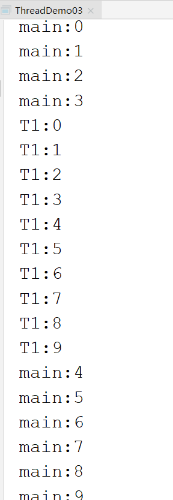


##### 线程的礼让 

* yield()，礼让仅仅是一种 尽可能事件，并不一定会100%执行

```java
public class ThreadDemo03 implements Runnable {
    @Override
    public void run() {
        for(int i=0;i<10;i++){
            System.out.println(   Thread.currentThread().getName()+":"+i  );
            if(i == 3){
                Thread.yield();
                System.out.println("礼让....");
            }
        }
    }
    
    public static void main(String[] args) throws InterruptedException {
        ThreadDemo03 t1 = new ThreadDemo03();
        Thread th1 = new Thread(t1,"T1") ;
        th1.start();

        ThreadDemo03 t2 = new ThreadDemo03();
        Thread th2 = new Thread(t2,"T2") ;
        th2.start();
    }
}
```

## 线程状态

### 线程执行需要的资源

* CPU资源
* 其他资源（程序计数器、io.....）

>一般而言，其他资源容易获取，而CPU最难获取

### 线程运行的五个状态

* 创建
* 就绪：只缺CPU，不缺其他资源
* 运行：有CPU+有其他全部资源
* 阻塞：缺CPU+缺其他资源

> A、B两个线程，A线程在打印，结果打印机被抢占（其他资源，其他资源被抢占，CPU也会连同一起缺失），A就会被阻塞

* 死亡

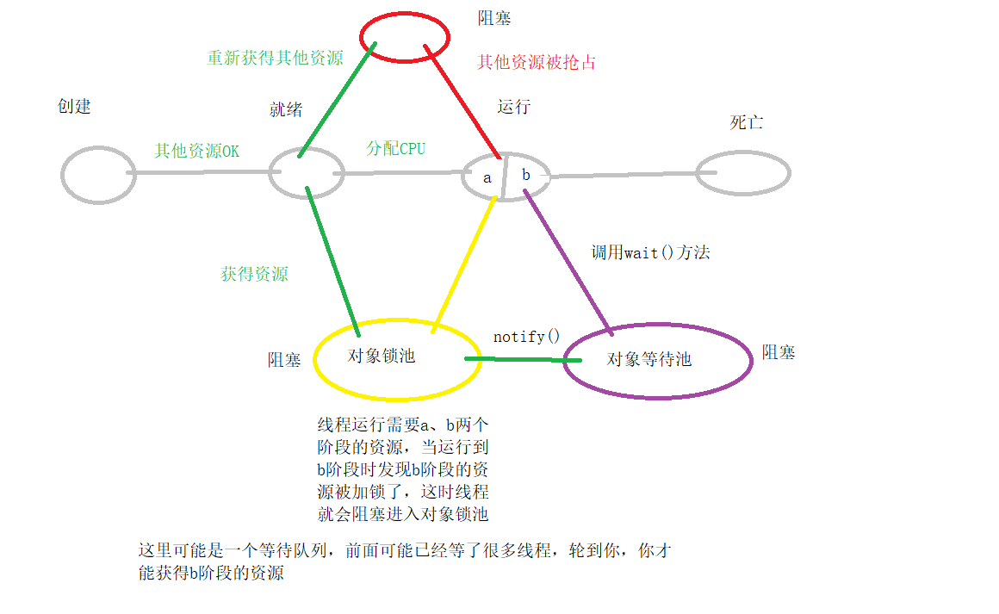

## 多线程示例

1.驾校练车： 某个驾校每天只能给30个学生练车，有20个普通学生，10个vip。开始时，普通和VIP并发叫号

- 叫到vip的概率比普通的高
- vip的练车时间是普通学生的3倍
- 要求vip学生必须在 普通学员之前全部结束

```java
package Thread;

class VipStudent implements Runnable {
    @Override
    public void run() {
        for (int i = 0; i < 10; i++) {
            System.out.println(i + "vip练车......");
            try {
                Thread.sleep(3000);
            } catch (InterruptedException e) {
                e.printStackTrace();
            }
        }
    }
}

class NormalStudent implements Runnable {

    private Thread vip;

    public NormalStudent() {
    }

    public NormalStudent(Thread vip) {
        this.vip = vip;
    }

    @Override
    public void run() {
        for (int i = 0; i < 20; i++) {
            System.out.println(i + "普通学员练车......");
            //如果普通学员到19，强行插入vip
            if (i == 18) {
                try {
                    vip.join();
                } catch (InterruptedException e) {
                    e.printStackTrace();
                }
            }

            try {
                Thread.sleep(1000);
            } catch (InterruptedException e) {
                e.printStackTrace();
            }
        }
    }
}

/**
 * @program: fileTest
 * @description: 驾校练车
 * @author: dzp
 * @create: 2021-04-22 10:56
 **/
public class ThreadPracticeCar {
    public static void main(String[] args) {
        VipStudent vipStudent = new VipStudent();
        Thread vip = new Thread(vipStudent);
        NormalStudent normalStudent = new NormalStudent(vip);
        Thread normal = new Thread(normalStudent);
        //设置优先级
        vip.setPriority(Thread.MAX_PRIORITY);
        normal.setPriority(Thread.NORM_PRIORITY);

        vip.start();
        normal.start();
    }
}
```

## 数据安全问题

当多个线程并发访问同一个资源时（对象、方法、代码块），经常会出现一些“不安全”的线程。

举例：假设有100张火车票，同时被a、b两个站点售卖。

> 线程安全问题  线程不安全问题  其实是一个问题   

#### 线程不安全代码示例

```java
package Thread;
/**
 * @program: fileTest
 * @description: 卖车票问题
 * @author: dzp
 * @create: 2021-04-22 15:40
 **/
public class TicketsDemo implements Runnable {
    private int tickets = 10000;

    @Override
    public void run() {
        while (true) {
            //卖火车票
            sell();
        }
    }

    public void sell() {
        if (tickets > 0) {
            tickets--;
            System.out.println(Thread.currentThread().getName() + "-正在售卖,剩余票数：" + tickets);
        }
    }

    public static void main(String[] args) {
        TicketsDemo ticket = new TicketsDemo();

        Thread a = new Thread(ticket, "a");
        Thread b = new Thread(ticket, "b");

        a.start();
        b.start();
    }
}
```

* 不安全情况一

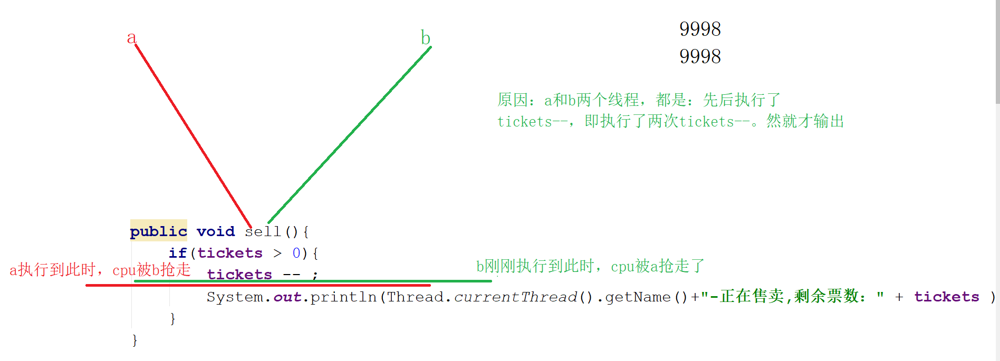

* 不安全情况二

只剩一张票，a、b执行到横线处，可能会打印结果**-1**


#### 如何解决 线程安全问题？ 

* 加锁：可以保证多个线程串行执行，即不要相互争夺着抢占资源

卫生间：a和b去卫生间。  如果a正在使用，则加一把锁，表示正在使用....

##### synchronized：给共享的资源加锁

###### 加锁的形式

- 给方法加锁

public  synchornized 返回值 方法名(){   ...  }

```java
    public  synchronized  void sell(){
        if(tickets > 0){
            tickets -- ;
            System.out.println(Thread.currentThread().getName()+"-正在售卖,剩余票数：" + tickets );
        }
    }
```

- 给代码块加锁

```java
    public  void sell(){
        synchronized (this) {//this：换成其他任意对象都可以（例如上卫生间时加的锁可以是一把真实的锁，也可以是一个提示牌...）
            if (tickets > 0) {
                tickets--;
                System.out.println(Thread.currentThread().getName() + "-正在售卖,剩余票数：" + tickets);
            }
        }
    }
```

##### 解锁

解锁的时机是以下任一个条件：

- 正常解锁：将sychronized修饰的方法、代码块执行完毕；
- 异常解锁：如果sychronized修饰的方法出现了异常，则会自动解锁

## 死锁

### 死锁的原因

resource-a 和resource-b两个资源，以及A\B两个线程。

A：已经占有 resource-a，等待使用resource-b

B:已经占有 resource-b，等待使用resource-a

### 死锁所造成的影响

死锁会严重造成系统资源的损耗： A、B两个线程处于长期等待状态；resource-a\resource-b两个资源被死锁的线程 长期锁住，但又无法发挥作用

### 死锁示例

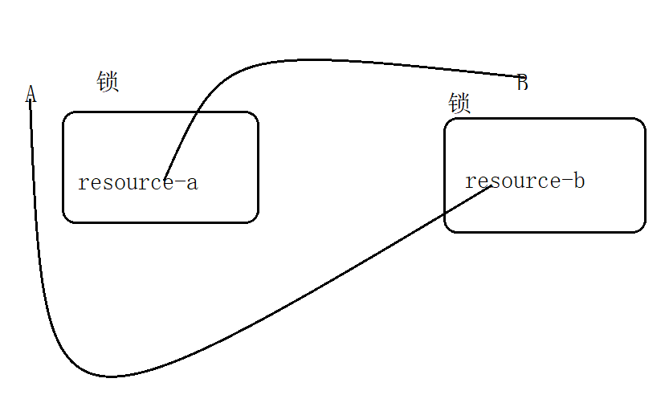

```java
//本题出现死锁的情况 是一种假设（线程是概率问题）：如果符合预期（A给a加了锁，在等待b;B给b加了锁，在等待a），则会出现死锁；否则，不会
class AThread implements  Runnable{
    @Override
    public void run() {
        synchronized (DeadLock.resource_a) {
            System.out.println("A线程：已经给resource-a加了锁");
            try {
                Thread.sleep((long)(Math.random()*3000) );
            } catch (InterruptedException e) {
                e.printStackTrace();
            }
			//synchronized是可重入🔒，即在🔒的里面可以再套一把🔒
            synchronized (DeadLock.resource_b){//尝试给B加锁
                System.out.println("A线程：等待给resource-b加锁...");
            }
        }
    }
}
class BThread implements  Runnable{
    @Override
    public void run() {
        synchronized (DeadLock.resource_b) {
            System.out.println("B线程：已经给resource-b加了锁");
            try {
                Thread.sleep((long)(Math.random()*3000) );
            } catch (InterruptedException e) {
                e.printStackTrace();
            }
            synchronized (DeadLock.resource_a){
                System.out.println("B线程：等待给resource-a加锁...");
            }
        }
    }
}

public class DeadLock {
    static String resource_a = "resource-a" ;
    static String resource_b = "resource-b" ;

    public static void main(String[] args) {
        Thread A = new Thread(new AThread());
        Thread B = new Thread(new BThread());

        A.start();
        B.start();
    }

}

```

### 死锁的解决

产生死锁的根本原因：（操作系统知识）

- 系统资源不足
- 多线程的执行顺序不合理：算法问题，解决死锁 可以通过算法解决： 银行家算法； ”产生死锁有四个必要条件“，避免死锁 就可以打破四种必要条件

## 线程安全和不安全的区别


|                              | 是否同步锁 | 效率 | 使用场景         |
| ---------------------------- | ---------- | ---- | ---------------- |
| 线程安全（不会出现并发问题） | 是         | 低   | 并发访问共享资源 |
| 非线程安全（出现并发问题）   | 否         | 高   | 吞吐量优先       |

哪个好？没有最好，只能说根据当前业务 哪个更加合适

## jdk中的线程安全/非线程安全的支持

Hashtable：线程安全，效率低

HashMap：非线程安全，效率高


StringBuffer/StringBuilder

StringBuffer：线程安全

StringBuilder: 非线程安全


ArrayList：1.非线程安全，可能会出现一些数据不安全的问题，甚至报错

​                    2.在设计之初 没有过多的考虑并发问题，因此有一些问题

源码：

~~~java
    /**
     * Appends the specified element to the end of this list.
     *
     * @param e element to be appended to this list
     * @return <tt>true</tt> (as specified by {@link Collection#add})
     */
    public boolean add(E e) {
        //判断当前大小是否够用，如果a、b两个线程都来了，在这里判断为够用，都往里放就会造成线程安全问题
        ensureCapacityInternal(size + 1);  // Increments modCount!!
        elementData[size++] = e;
        return true;
    }
~~~

示例：ArrayList在设计时 存在的问题

```java
package juc;

import java.util.ArrayList;
import java.util.Iterator;
import java.util.List;

public class ArrayListDemo {
    public static void main(String[] args) {
        List<String> list = new ArrayList<>();
        list.add("aaa") ;
        list.add("bb") ;
        list.add("cc") ;
        Iterator<String> iter = list.iterator();
        while(iter.hasNext()){
            System.out.println(iter.next());

            list.add("xxx");
        }
    }
}

```

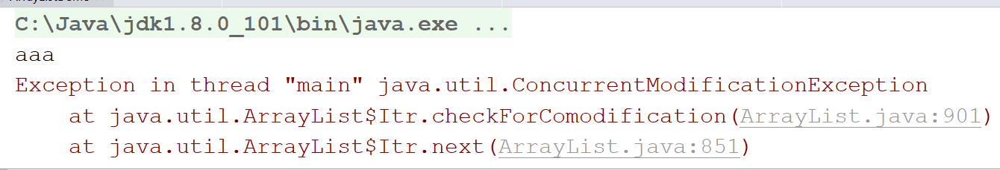

以上代码，的iter.next()是java.util.ArrayList.Itr中的next()方法。

```java
        final void checkForComodification() {
            if (modCount != expectedModCount)
                throw new ConcurrentModificationException();
        }
```

modCoutn是迭代器实际的指向位置；expectedModCount是迭代器期望的指向位置；为了防止数据被篡改，arraylist会判断二者是否相等。

通过源码可知：ArrayList的add()会增加modCount 。正常流程：先add()，并且在add()时会 增加modCount，然后iter.next()来检查modCount\expectedModCount是否相等； 

本程序的错误流程：先add()，再iter.next() 、又add()、又iter.next() 

> 以上：if(modCount != expectedModCount)非常类似 版本控制技术，严格来讲 被称为  "fail-fast策略"

**解决：使用juc中相应对ArrayList的并发支持：CopyOnWriteArrayList**

## JUC

java.util.concurrent：包名，从jdk.1.5之后提供，包含了很多 用于并发编程的工具类

> 并发容器：CopyOnWriteArrayList，CopyOnWrite*... ,ConcurrentHashMap,Concurrent* ,PriorityBlockingQueue

### CopyOnWriteArrayList

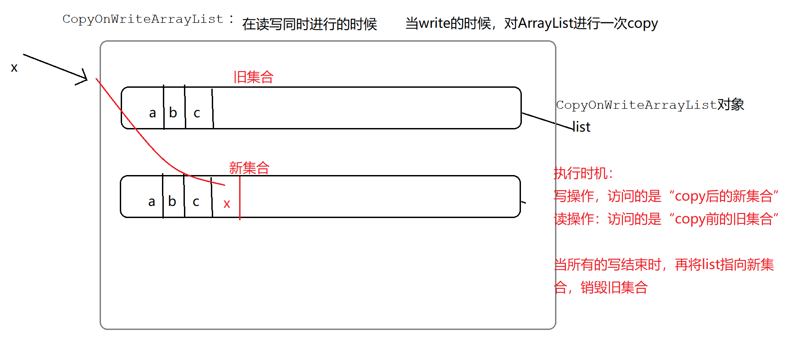

使用CopyOnWrite解决ArrayList并发问题

> 思想 读写分离

```java
package juc;

import java.util.ArrayList;
import java.util.Iterator;
import java.util.List;
import java.util.concurrent.CopyOnWriteArrayList;

public class ArrayListDemo {
    public static void main(String[] args) {
        CopyOnWriteArrayList<String> list = new CopyOnWriteArrayList<>();
        list.add("aaa") ;
        list.add("bb") ;
        list.add("cc") ;
        Iterator<String> iter = list.iterator();
        while(iter.hasNext()){
            System.out.println(iter.next());
            list.add("xxx");
        }
        System.out.println("---");

        Iterator<String> iter2 = list.iterator();
        while(iter2.hasNext()){
            System.out.println(iter2.next());
        }
    }
}
```

### ConcurrentHashMap

#### 作用

提升HashMap的并发性能

#### 两个大版本

##### JDK7

###### HashMap结构

结构= 数组+链表

* 数组层面

HashMap的元素是一个 由key-value组成的元素（entry)

如果entry存放到hashmap中：

会先根据此entry的key值计算出一个 hashcode，然后再将这个hashcode和数组的长度求余，计算出来的值 就是数组的下标。之后该entry元素 就会存入到该下标对应的 数组中元素中。例如，entry(key=s01,value=stu01)：先计算s01的hashcode(比如是123)，然后 123%数组长度(比如长度是10) ，结果是3。然后这个结果3就是数组元素的下标，最后将 该entry存放如 数组的第3个位置中。

* 链表层面

如果有多个entry最终的计算结果相同（key01=111,key02=221,则这两个entry的计算结果都是1），则这么多相同结果的entry用链表链接起来。

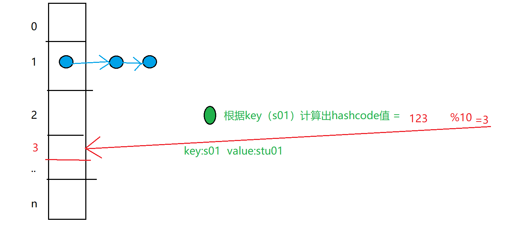

> HashMap是非线程安全，可能存在并发问题。如何解决？ConcurrentHashMap可以用于解决并发问题

###### ConcurrentHashMap结构

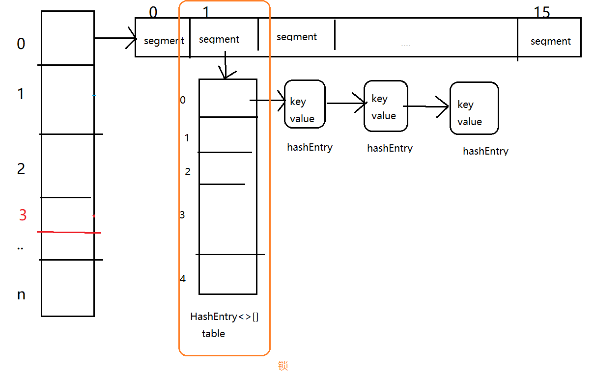

> 解决并发问题：给每一个segment加一把锁。既可以用锁来避免并发访问时的冲突；又避免“给整个容器枷锁”导致性能降低的情况

##### JDK8

HashMap/ConcurrentHashMap结构类似

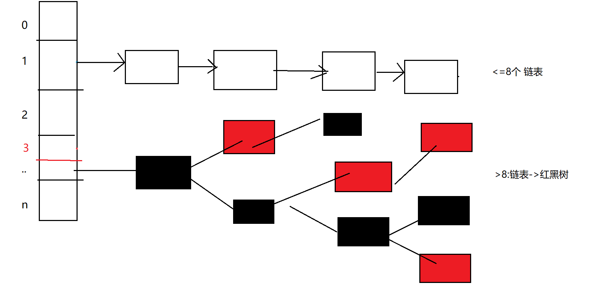


#### HashMap/ConcurrentHashMap区别

ConcurrentHashMap解决并发问题：大量使用了volatile（线程可见性）、synchronized（锁）、CAS无锁算法实现的

> HashMap/ConcurrentHashMap二者都是一个AbstractMap的子类，是平级的，二者之间没有继承关系

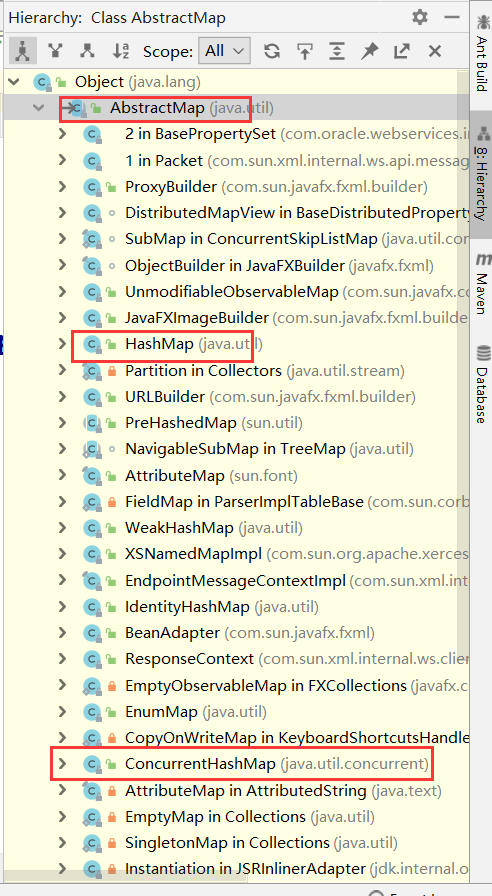


使用层面：不考虑并发，使用HashMap；如果在高并发环境，ConcurrentHashMap。

使用案例：

```java
package juc;

import java.util.concurrent.ConcurrentHashMap;

public class TestConcurrentHashMap {
    public static void main(String[] args) {
        ConcurrentHashMap<String,Object> chm =  new ConcurrentHashMap<>();
        chm.put("s01", new Object());
        chm.put("s02", new Object());
        chm.put("s03", new Object());
        chm.putIfAbsent("s03",new Object());//如果key不存在，则增加；否则不增加

        System.out.println(chm);
    }
}

```

## 读写锁


在一般的项目中，都是读多写少，并且只有“写”可能引起并发冲突。 就可以设置成 读写分离：读写锁

### juc中的读写锁

```java
public interface ReadWriteLock {
    /**
     * Returns the lock used for reading.
     *
     * @return the lock used for reading
     */
    Lock readLock();

    /**
     * Returns the lock used for writing.
     *
     * @return the lock used for writing
     */
    Lock writeLock();
}

```

- 读锁：readLock()。加了读锁的资源，可以在没有写锁的情况下 被多个线程共享。即：如果t1线程已经加了读锁，那么此时：

  - 如果t2要申请写锁，则t2会一直等待t1解锁

  - 如果t2要申请读锁，则t2会直接加读锁。也就是说，t1和t2可以共同加读锁（可重入锁，t1线程加完读锁以后，t2线程也可以再加一把读锁）

     > 小结：如果一个线程a加了读写，另一些线程只有在 申请加写锁时，才需要等待线程a解锁

- 写锁：writeLock()，独占锁。如果一个线程a加了写锁，则其他线程必须等待a解锁

一个资源线程a加了写锁以后，其他线程必须等待线程a解锁以后，才能访问该资源

~~~java
package juc;

import java.util.concurrent.locks.ReadWriteLock;
import java.util.concurrent.locks.ReentrantReadWriteLock;

public class ReadWriteLockDemo {
    //可重入的读写锁
    ReentrantReadWriteLock rwl = new ReentrantReadWriteLock() ;
	
    public static void main(String[] args) {
        ReadWriteLockDemo demo = new  ReadWriteLockDemo();
            new Thread(  () ->{
                //读
                demo.readMethod(Thread.currentThread());
                //写
                demo.writeMethod(Thread.currentThread());

            },"t1" ).start( );

            new Thread(   () ->{
                //读
                demo.readMethod(Thread.currentThread());
                //写
                demo.writeMethod(Thread.currentThread());

            },"t2" ).start( );
    }

    //读
    private void readMethod(Thread t ){
        //读锁加锁
        rwl.readLock().lock();
        try {
            for (int i = 0; i < 9999; i++) {
                System.out.println(t.getName() + "正在执行读操作...");
            }
            System.out.println(t.getName() + "读操作【完毕】...");
        }finally {
            //读锁解锁
            rwl.readLock().unlock();
        }
    }
    //写
    private void writeMethod(Thread t){
        //写锁加锁
        rwl.writeLock().lock();
        try {
            for (int i = 0; i < 9999; i++) {
                System.out.println(t.getName() + "正在执行写操作...");
            }
            System.out.println(t.getName() + "写操作【完毕】...");
        }finally {
            //写锁解锁
            rwl.writeLock().unlock();
        }
    }
}
~~~

## 线程通信

### 目的

多个线程在争夺同一个资源时，为了保证协同工作，可以进行线程通信

> a线程操作完资源以后，可以通知b线程来操作资源

### 通信主要依赖于3个方法

- wait（）【自己使自己】：使当前线程处理等待状态（阻塞），一直到其他线程调用此线程的notify()或notifyAll()方法
- notify()【别人调自己】：唤醒一个正在等待线程；如果有多个线程正在等待，则随机唤醒一个。
- notifyAll()【别人调自己】：唤醒全部正在等待的线程

### 注意事项

#### 等待的线程由谁唤醒？

线程在等待时，会被一个监听器所监听，因此，当其他线程调用notify()、notifyAll()时，实际是通过监听器来唤醒线程

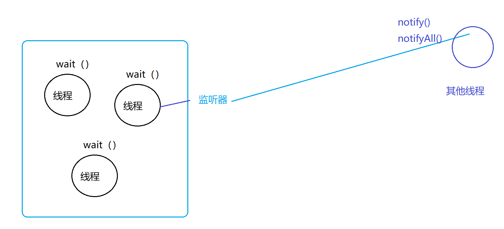

#### 三个线程通信的方法由谁定义？

是Object定义native方法。因为锁是 对象级，不是线程级的。

```java
synchronized{
    ...
}

```

因为任何对象都可以使用synchronized加锁，而线程通信又依赖于加锁，因此线程通信属于“任何对象”的使用范围，即对象级，所以是在Object中定义的。

#### 方法定义的位置

这三个方法，必须定义在synchronized中定义，否则报异常

> 必须加锁才能通信

#### 建议

jdk建议：为了避免一些并发问题，建议将wait()方法写在循环中，如下：

```java
     * As in the one argument version, interrupts and spurious wakeups are
     * possible, and this method should always be used in a loop:
     * <pre>
     *     synchronized (obj) {
     *         while (&lt;condition does not hold&gt;)
     *             obj.wait();
     *         ... // Perform action appropriate to condition
     *     }
     * </pre>
```

### 信号量Semaphor

* Semaphor编程
  * 默认所有的线程都是阻塞
  * 有个一许可acquire()，只有获取了许可的线程 ，才能运行
  * 许可的数量，可以通过persmits属性设置
  * release()释放许可

以下示例：有10个线程尝试执行，但只有3个许可证

```java
package juc;

import java.util.concurrent.ExecutorService;
import java.util.concurrent.Executors;
import java.util.concurrent.Semaphore;

public class SemaphoreDemo {
    public static void main(String[] args) {

        ExecutorService executor = Executors.newCachedThreadPool();
        //同一时间 最多有3个线程可以并发运行
        Semaphore sem = new Semaphore(3) ;
        //假设有10个线程
        for( int i=0;i<10;i++){
            final int tId = i ;
            executor.execute(
                         () ->{
                             try{
                                 //获取许可（同一时间 只有3个许可）
                                 sem.acquire();
                                 System.out.println("线程" + tId +"获取到了许可，正在执行");
                                Thread.sleep((long)(5000*Math.random()));
                                sem.release();//释放许可
                             }catch (InterruptedException e){

                             }catch(Exception e){
                                 e.printStackTrace();
                             }
                         }
            );//给线程中 加入一个新线程
        }
//            executor.shutdown();
    }
}
```

## 生产者消费者案例（线程通信）

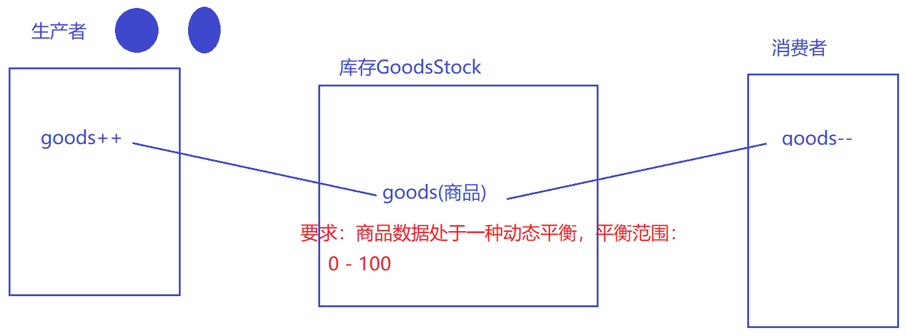

### 库存

```java
package Thread.scxfmodel;

/**
 * @program: fileTest
 * @description: 库存
 * @author: dzp
 * @create: 2021-04-25 16:08
 **/
public class GoodsStock {

    int goodNum;

    public synchronized void produce() {
        try {
            if (goodNum < 100) {
                goodNum++;
                //唤醒消费者
                notifyAll();
                //随机睡一秒以内
                Thread.sleep((int) (Math.random() * 10));
                System.out.println("生产商品，数量是：" + goodNum);
            } else {
                //使自己阻塞
                wait();
            }
        } catch (InterruptedException e) {
            e.printStackTrace();
        }

    }

    public synchronized void consume() {
        try {
            if (goodNum > 0) {
                goodNum--;
                //唤醒生产者
                notifyAll();
                //随机睡一秒以内
                Thread.sleep((int) (Math.random() * 10));
                System.out.println("消费商品，数量是：" + goodNum);
            } else {
                //使自己阻塞
                wait();
            }
        } catch (InterruptedException e) {
            e.printStackTrace();
        }
    }
}
```

### 生产者

```java
package Thread.scxfmodel;

/**
 * @program: fileTest
 * @description: 生产者
 * @author: dzp
 * @create: 2021-04-25 16:09
 **/
public class GoodsProducer implements Runnable {

    GoodsStock goodsStock = new GoodsStock();

    GoodsProducer() {
    }

    GoodsProducer(GoodsStock goodsStock) {
        this.goodsStock = goodsStock;
    }

    @Override
    public void run() {
        while (true) {
            goodsStock.produce();
        }
    }
}
```

### 消费者

```java
package Thread.scxfmodel;

/**
 * @program: fileTest
 * @description: 消费者
 * @author: dzp
 * @create: 2021-04-25 16:10
 **/
public class GoodsConsumer implements Runnable {

    GoodsStock goodsStock = new GoodsStock();

    GoodsConsumer() {
    }

    GoodsConsumer(GoodsStock goodsStock) {
        this.goodsStock = goodsStock;
    }

    @Override
    public void run() {
        while (true) {
            goodsStock.consume();
        }
    }
}
```

测试

```java
package Thread.scxfmodel;

/**
 * @program: fileTest
 * @description: ceshi
 * @author: dzp
 * @create: 2021-04-25 16:35
 **/
public class Test {
    public static void main(String[] args) {
        //库存
        GoodsStock goodsStock = new GoodsStock();
        //生产者（多个生产者享受一个库存）
        GoodsProducer goodsProducer = new GoodsProducer(goodsStock);
        //消费者
        GoodsConsumer goodsConsumer = new GoodsConsumer(goodsStock);

        Thread gp1 = new Thread(goodsProducer, "gp1");
        Thread gp2 = new Thread(goodsProducer, "gp2");

        Thread gc1 = new Thread(goodsConsumer, "gc1");
        Thread gc2 = new Thread(goodsConsumer, "gc2");

        gp1.start();
        gp2.start();

//        gc1.start();
        gc2.start();

    }
}
```

运行结果


## 改造生产者消费者（线程通信）

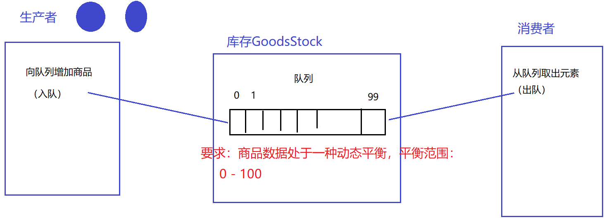

### 队列、线程池

商品

```java
package producerandconsumer2;
//商品
public class Goods {
    private int id ;
    private String name ;

    public Goods() {
    }
    public Goods(int id, String name) {
        this.id = id;
        this.name = name;
    }

    public int getId() {
        return id;
    }

    public void setId(int id) {
        this.id = id;
    }

    public String getName() {
        return name;
    }

    public void setName(String name) {
        this.name = name;
    }
}

```

带队列的库存：

```java
package producerandconsumer2;

import sun.security.provider.NativePRNG;

import java.util.concurrent.BlockingQueue;
import java.util.concurrent.TimeUnit;

//库存
public class GoodsStock {
    //队列：生产者和消费者 共享的队列
    private BlockingQueue<Goods> queue ;
    //记录一共生产了多少商品
    private static int count ;

    public GoodsStock(BlockingQueue<Goods> queue) {
        this.queue = queue;
    }

    public GoodsStock() {
    }
    
    //新增
    public synchronized void produceGoods(){
        try {
            Goods goods = new Goods();
            //3秒之内放成功，就算成功
            boolean flag = queue.offer(goods, 3, TimeUnit.SECONDS);
            if(flag){
                count++ ;
                goods.setId(count);
                goods.setName("goods"+count);
                System.out.println("生产成功：商品编号："+goods.getId()+",名字："+goods.getName()  );
                Thread.sleep((long)(Math.random()*10));
				
                //有新商品了，通知消费者消费...
                notifyAll();
            }else{
                System.out.println("生产商品失败...");
            }

            if(queue.size() >= 100){
                System.out.println("库存已满，等待消费。。。");
                wait();
            }


        }catch(Exception e){
            e.printStackTrace();
        }

    }

    //减少
    public synchronized void consumeGoods(){
        try {
            Goods goods = queue.poll(3, TimeUnit.SECONDS);
            if(goods != null){
                System.out.println("消费goods，编号："+goods.getId()+ ",名称："+goods.getName());
                Thread.sleep( (long)(Math.random()*10) );
                //消费成功，通知生产者生产
                notifyAll();
            }else{
                System.out.println("消费失败。。。");
            }
            if(queue.size()>0){

            }else{
                System.out.println("库存为空，等待生产。。。");
                wait();
            }
        }catch (Exception e){
            e.printStackTrace();
        }

    }
}

```

生产者

```java
package producerandconsumer2;

public class GoodsProducer implements Runnable {

    GoodsStock stock ;

    public GoodsProducer(){

    }

    public GoodsProducer(GoodsStock stock){
        this.stock = stock ;
    }

    @Override
    public void run() {
        //生产商品
        while(true){
            stock.produceGoods();//生产
        }
    }
}

```

消费者

```java
package producerandconsumer2;

public class GoodsConsumer implements Runnable {
    
    GoodsStock goodsStock ;

    public GoodsConsumer(){
    }
   
    public GoodsConsumer(GoodsStock goodsStock){
        this.goodsStock = goodsStock ;
    }

    @Override
    public void run() {
        while(true){
            goodsStock.consumeGoods();
        }
    }
}

```

测试

```java
package producerandconsumer2;

import java.util.concurrent.BlockingQueue;
import java.util.concurrent.ExecutorService;
import java.util.concurrent.Executors;
import java.util.concurrent.LinkedBlockingQueue;

public class Test {
    public static void main(String[] args) throws InterruptedException {
        BlockingQueue<Goods> queue = new LinkedBlockingQueue<>(100);
		//商品库存
        GoodsStock goodsStock = new GoodsStock(queue) ;

        GoodsProducer produce1 = new GoodsProducer(goodsStock) ;
        GoodsProducer produce2 = new GoodsProducer(goodsStock) ;

        GoodsConsumer consumer1 = new GoodsConsumer(goodsStock) ;
        GoodsConsumer consumer2 = new GoodsConsumer(goodsStock) ;

        //将生产者和消费者加入线程池
        ExecutorService executorService = Executors.newCachedThreadPool();
        //从线程池中取线程执行生产者和消费者
        executorService.execute(produce1);
        executorService.execute(produce2);
        executorService.execute(consumer1);
        executorService.execute(consumer2);
        Thread.sleep(20000);
        executorService.shutdown();
    }
}
```

## Lock（线程通信）

* 第一种方式：

```
synchronized + wait()/notify()/notifyAll()
```

* 另一种形式（更加强大）：

synchronized {}  加锁/解锁   ——    Lock( lock(), unlock() )  加锁/解锁

wait()                ——    Condition中的await()方法

notify()/notifyAll() ——Condition中的signal()/signalAll()方法

* 修改后Lock方式修改以上代码

```java
package producerandconsumer3;

import java.util.concurrent.BlockingQueue;
import java.util.concurrent.TimeUnit;
import java.util.concurrent.locks.Condition;
import java.util.concurrent.locks.Lock;
import java.util.concurrent.locks.ReentrantLock;

//库存
public class GoodsStock {
    //队列：生产者和消费者 共享的队列
    private BlockingQueue<Goods> queue ;
    private static int count ;//记录一共生产了多少量商品
	//使用可重入锁 a线程加完 b线程可以再加
    private Lock lock = new ReentrantLock() ;
    private Condition condition =  lock.newCondition();

    public GoodsStock(BlockingQueue<Goods> queue) {
        this.queue = queue;
    }

    public GoodsStock() {
    }
    //新增
    public  void produceGoods(){
        //加锁
        lock.lock();
        try {
            Goods goods = new Goods();
            boolean flag = queue.offer(goods, 3, TimeUnit.SECONDS);
            if(flag){
                count++ ;
                goods.setId(count);
                goods.setName("goods"+count);
                System.out.println("生产成功：商品编号："+goods.getId()+",名字："+goods.getName() +",库存："+ queue.size() );
                Thread.sleep((long)(Math.random()*10));
				//有新商品了，通知消费者消费...
                //notifyAll();
                condition.signalAll();
            }else{
                System.out.println("生产商品失败...");
            }

            if(queue.size() >= 100){
                System.out.println("库存已满，等待消费。。。");
				// wait();
                condition.await();
            }
        }catch(Exception e){
            e.printStackTrace();
        }finally {
            //解锁
            lock.unlock();
        }

    }

    //减少
    public  void consumeGoods(){
        lock.lock();
        try {
            Goods goods = queue.poll(3, TimeUnit.SECONDS);
            if(goods != null){
                System.out.println("消费goods，编号："+goods.getId()+ ",名称："+goods.getName() +",库存："+ queue.size());
                Thread.sleep( (long)(Math.random()*10) );
//                notifyAll();
                condition.signalAll();
            }else{
                System.out.println("消费失败。。。");
            }
            if(queue.size()>0){

            }else{
                System.out.println("库存为空，等待生产。。。");
//                wait();
                condition.await();
            }


        }catch (Exception e){
            e.printStackTrace();
        }finally {
            lock.unlock();
        }

    }
}

```

## Synchronized与Lock的区别

|      | synchronized                  | Lock                               |
| ---- | ----------------------------- | ---------------------------------- |
| 形式 | 关键字                        | 接口                               |
| 加锁 | {                             | lock()，尝试加锁（尝试一段时间等） |
| 解锁 | }，方法正常结束或程序出现异常 | unlock()                           |
| 状态 | 无法判断                      | 可以判断                           |
| 中断 | 不支持                        | 支持                               |

> synchronized加锁方式为直接加锁，成功即成功，失败即失败，但是lock()如果加锁失败，可以在一段时间内尝试再次加锁（如3秒，3秒内加锁失败可以尝试再次加锁）

**建议：建议使用Lock，更加强大**

尝试加锁的代码

```java
package juc;

import java.util.concurrent.TimeUnit;
import java.util.concurrent.locks.Lock;
import java.util.concurrent.locks.ReentrantLock;

public class TryLockDemo extends Thread {
    //设为静态，两个线程共用一把锁
  	private static Lock lock =   new ReentrantLock();
    @Override
    public void run() {
        String threadName = Thread.currentThread().getName();
        boolean flag = false ;
        try {
            //尝试加锁 5 毫秒
           	flag = lock.tryLock(5, TimeUnit.MICROSECONDS);
            System.out.println("尝试加锁结果："+flag);
            if(flag){
                System.out.println(threadName+"加锁成功...");
                //加锁成功以后，占用资源0.02秒
                Thread.sleep(20);
            }else{
                System.out.println(threadName+"加锁失败。。。");
            }
        }catch (Exception e){
            e.printStackTrace();
        }finally {
            //如果是加锁，再来解锁
            if(flag) {
                System.out.println(threadName + "解锁...");
                lock.unlock();
            }
        }
    }

    public static void main(String[] args) {
        TryLockDemo t1 = new TryLockDemo();
        TryLockDemo t2 = new TryLockDemo();
        t1.setName("t1");
        t2.setName("t2");
        t1.start();
        t2.start();

    }
}
```

## 中断等待

场景：如果线程t要访问某个一资源，但此资源已经被其他线程长期加了锁，则线程t可以被其他线程结束等待状态（将该等待线程中断）

* Api使用

```
lock.lockInterruptibly();//加了一把可被中断的锁

如何中断？ 调用一个interrupt();

如果线程被中断 会抛出一个异常InterruptedException
```

* 代码逻辑

在main中有三个线程t1、t2、main，main休眠一秒，t1和t2休眠三秒，main醒了以后，中断线程t2

```java
package juc;

import java.util.concurrent.locks.Lock;
import java.util.concurrent.locks.ReentrantLock;

class MyThread extends  Thread{
    WaitInterrupt waitInterrupt ;
    public MyThread(WaitInterrupt waitInterrupt){
        this.waitInterrupt = waitInterrupt ;
    }


    @Override
    public void run() {
        try {
            waitInterrupt.myLock(Thread.currentThread());//当前线程休眠3秒
        }catch (Exception e){
            System.out.println(Thread.currentThread().getName()+"被中断");
        }
    }
}

public class WaitInterrupt {
    private Lock lock = new ReentrantLock() ;

    public static void main(String[] args) throws  Exception {

        WaitInterrupt inter = new WaitInterrupt();
        MyThread t1 = new MyThread(inter);
        t1.setName("t1");
        MyThread t2 = new MyThread(inter);
        t2.setName("t2");

        t1.start();//休眠3秒
        t2.start();//休眠3秒

        Thread.sleep(1000);//main线程休眠1秒
        t2.interrupt();//中断t2
    }


    public void myLock(Thread thread   )throws InterruptedException {
        try {

            lock.lockInterruptibly();//加了一把可被中断的锁

            System.out.println( thread.getName() + "加锁");
            Thread.sleep(3000);
        }
        finally
        {
            lock.unlock();
            System.out.println( thread.getName() + "解锁");
        }
    }

}

```

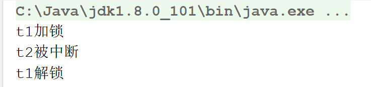


## 无锁算法CAS

为了保证并发环境下的数据安全，可以使用锁，也可以使用一种无锁算法——CAS算法

### 加锁缺点

消耗系统资源比较大（切换上下文对象【本来cpu给了线程t1，现在给线程t2】，造成CPU调度很频繁）。如图，将cpu从t1切换到t2是一种比较消耗CPU资源的操作

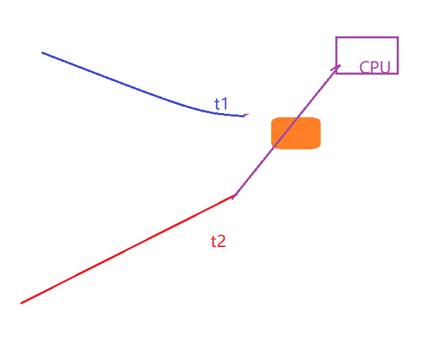


### 加锁与CAS对比（悲观锁和乐观锁）

加锁：是一种悲观策略，线程在访问资源时  总认为会和其他资源造成冲突，因此需要加锁。

CAS：是一种乐观策略，线程在访问资源时  总认为不会和其他资源造成冲突，因此有两种可能：

- 假设成功（的确没有和其他线程产生冲突）

  OK

- 假设失败（实际和其他线程产生了冲突）

  重新获取最新的资源，然后再次访问（如果发现要访问的资源不是最新的，则一直尝试；直到拿到最新数据为止）

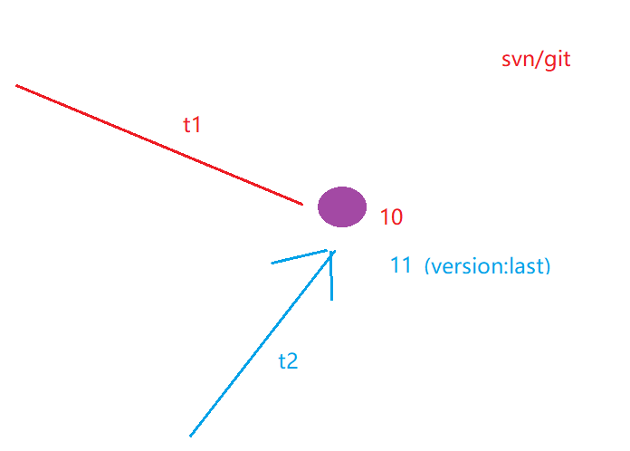

## 多线程打印（习题）

* 使用synchronized实现

~~~java
package Thread;

/**
 * @program: fileTest
 * @description: 循环打印
 * 多线程交替打印123123123...（两种以上方法实现）
 * 一、
 * num:打印的数字1、2、3
 * 线程1：判断数字是否为1，如果是则打印，如果不是则等待，打印完以后通知线程2
 * 线程2：判断数字是否为2，如果是则打印，如果不是则等待，打印完以后通知线程3
 * 线程3：判断数字是否为3，如果是则打印，如果不是则等待，打印完以后通知线程1
 * @author: dzp
 * @create: 2021-04-26 15:43
 **/

/**
 * 打印
 */
public class LoopPrint {

    int num = 1;

    public void print1() throws InterruptedException {
        synchronized (this) {
            if (num == 1) {
                System.out.print(num);
                Thread.sleep(1000);
                num = 2;
                notifyAll();
            } else {
                wait();
            }
        }
    }

    public void print2() throws InterruptedException {
        synchronized (this) {
            if (num == 2) {
                System.out.print(num);
                Thread.sleep(1000);
                num = 3;
                notifyAll();
            } else {
                wait();
            }
        }
    }

    public void print3() throws InterruptedException {
        synchronized (this) {
            if (num == 3) {
                System.out.print(num);
                Thread.sleep(1000);
                num = 1;
                notifyAll();
            } else {
                wait();
            }
        }
    }

    public static void main(String[] args) {
        LoopPrint loopPrint = new LoopPrint();

        new Thread(() -> {
            while (true) {
                try {
                    loopPrint.print1();
                } catch (InterruptedException e) {
                    e.printStackTrace();
                }
            }
        }).start();

        new Thread(() -> {
            while (true) {
                try {
                    loopPrint.print2();
                } catch (InterruptedException e) {
                    e.printStackTrace();
                }
            }
        }).start();

        new Thread(() -> {
            while (true) {
                try {
                    loopPrint.print3();
                } catch (InterruptedException e) {
                    e.printStackTrace();
                }
            }
        }).start();
    }
}
~~~

* 使用Lock接口实现

~~~java
package Thread;

import java.util.concurrent.locks.Condition;
import java.util.concurrent.locks.Lock;
import java.util.concurrent.locks.ReentrantLock;

/**
 * @program: fileTest
 * @description: 打印线程02
 * @author: dzp
 * @create: 2021-04-26 16:22
 **/
public class LoopPrintByLock {
    /**
     * 一个变量
     */
    private int num = 1;

    /**
     * 只有一个变量，因此只需要一把锁。但需要通知三个线程，因此需要三个“条件通知”
     */
    Lock lock = new ReentrantLock();

    /**
     * 三个通知
     */
    Condition condition1 = lock.newCondition();
    Condition condition2 = lock.newCondition();
    Condition condition3 = lock.newCondition();

    public void print1() {
        //加锁
        lock.lock();
        try {
            //线程1： 判断num是否为1，如果不是，则等待；如果是，则打印，打印完后 [通知]线程2
            if (num != 1) {
                condition1.await();
            }
            System.out.print(num);
            Thread.sleep(3000);
            num = 2;
            condition2.signal();
        } catch (Exception e) {
            System.out.println(e);
        } finally {
            //解锁
            lock.unlock();
        }
    }

    public void print2() {
        //加锁
        lock.lock();
        try {
            //线程2： 判断num是否为2，如果不是，则等待；如果是，则打印，打印完后 [通知]线程3
            if (num != 2) {
                condition2.await();
            }
            System.out.print(num);
            Thread.sleep(3000);
            num = 3;
            condition3.signal();
        } catch (Exception e) {
            System.out.println(e);
        } finally {
            //解锁
            lock.unlock();
        }
    }

    public void print3() {
        //加锁
        lock.lock();
        try {
            //线程3： 判断num是否为3，如果不是，则等待；如果是，则打印，打印完后 [通知]线程1
            if (num != 3) {
                condition3.await();
            }
            System.out.print(num);
            Thread.sleep(3000);
            num = 1;
            condition1.signal();
        } catch (Exception e) {
            System.out.println(e);
        } finally {
            //解锁
            lock.unlock();
        }
    }

    public static void main(String[] args) {
        LoopPrintByLock loopPrintByLock = new LoopPrintByLock();
        new Thread(() -> {
            while (true) {
                loopPrintByLock.print1();
            }
        }).start();

        new Thread(() -> {
            while (true) {
                loopPrintByLock.print2();
            }
        }).start();

        new Thread(() -> {
            while (true) {
                loopPrintByLock.print3();
            }
        }).start();
    }
}
~~~

* 使用Semaphore信号量实现

~~~java
package Thread;

import java.util.concurrent.Semaphore;

/**
 * @program: fileTest
 * @description: 通过信号量实现打印
 * @author: dzp
 * @create: 2021-04-28 18:13
 **/
public class LoopPrintBySemaphore {

    /**
     * 要打印1 2 3 需要3个信号量 只有一个通信证
     * 1 拿到打印1
     * 2 拿到打印2
     * 3 拿到打印3
     */
    Semaphore sem1 = new Semaphore(1);
    Semaphore sem2 = new Semaphore(0);
    Semaphore sem3 = new Semaphore(0);

    /**
     * @param value   当前值 1 2 3
     * @param current 当前谁用许可证
     * @param next    下一个谁拿许可证
     */
    private void print(int value, Semaphore current, Semaphore next) {
        while (true) {
            try {
                //当前信号量 获取许可证
                current.acquire();
                System.out.print(value);
                Thread.sleep(1000);
                //将许可证传递给下一个
                next.release();
            } catch (InterruptedException e) {
                e.printStackTrace();
            }
        }
    }

    private void print1() {
        print(1, sem1, sem2);
    }

    private void print2() {
        print(2, sem2, sem3);
    }

    private void print3() {
        print(3, sem3, sem1);
    }

    public static void main(String[] args) {
        LoopPrintBySemaphore loopPrintBySemaphore = new LoopPrintBySemaphore();
        new Thread(() -> {
            loopPrintBySemaphore.print1();
        }).start();

        new Thread(() -> {
            loopPrintBySemaphore.print2();
        }).start();

        new Thread(() -> {
            loopPrintBySemaphore.print3();
        }).start();
    }
}
~~~


