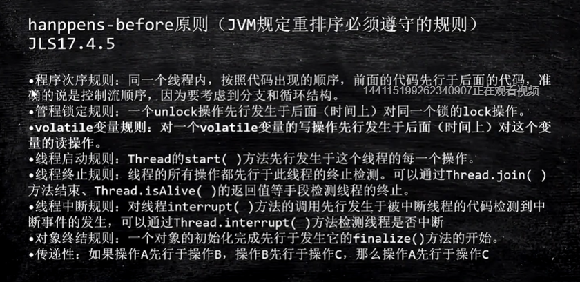
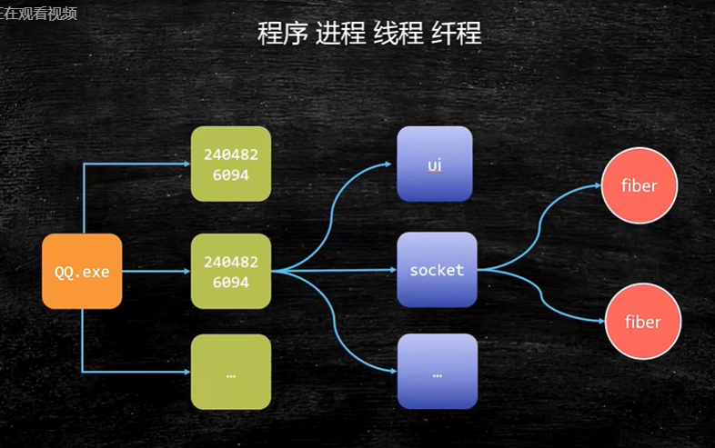

# 汇编语言（机器语言）的执行过程

* 汇编语言的本质：机器语言的助记符  其实它就是机器语言

* 计算机通电-》CPU读取内存中的程序（电信号输入）-》时钟发生器不断震荡通断电（主频）-》推动CPU内部一步一步执行（执行多少步取决于指令需要的时钟周期）-》计算完成-》写回（电信号）-》写给显卡输出

* C编译完的代码放到内存中直接就是机器码，可以被CPU直接执行

* Java在内存中是二进制码（ByteCode），读一条指令交给JVM，翻译成机器码，CPU执行【解释执行】

* 计算机内存里面就是存着电信号

# CPU基本组成

PC -》Program Counter 程序计数器（记录当前指令地址）

Registers -> 暂时存储CPU计算需要用到的数据

ALU -》 Arithmetic & Logic Unit 运算单元

CU -》Control Unit 控制单元

MMU -》Memory  Management Unit 内存管理单元

# 禁止乱序

CPU层面：

* Intel -》原语 （mfence lfence sfence）或者锁总线

* lock指令

JVM层面：8个happens-before原则   4个内存屏障

as-if-serial：不管硬件什么顺序，单线程执行的结果不变，看上去像是serial

# NUMA

Non Uniform Memoey Acess

ZGC - NUMA aware

分配内存会优先分配该线程所在CPU的最近内存

# 系统启动过程（不重要）

通电 -》bios  uefi工作  -》 自检  -》 到硬盘固定加载位置bootloader  -》 读取可配置信息

-》 CMOS

# OS基础

## kernel（内核）

* 宏内核
* 微内核

用户态没法直接操作内核态所属的内存，要想读取硬盘，要从用户态的3级别切换到内核态的0级别，让它自己去执行0级命令操作硬盘（操作系统的健壮性）

## 用户态和内核态

cpu分不同的指令级别

linux内核跑在ring 0级，用户程序跑在ring 3，对于系统的关键访问，需要经过kernel的同意，保证系统健壮性

内核执行的操作 -》200多个

JVM -》站在OS老大的角度，就是个普通程序

# 进程 线程 纤程 中断

进程和线程有什么区别？

进程就是一个应用程序运行起来的状态，线程是一个进程中不同的执行路径

专业：进程是OS分配资源的基本单位，线程是执行调度的基本单位

分配资源最重要的是：独立的内存空间，线程调度执行（线程共享进程的内存空间，没有自己独立的内存空间）

纤程：用户态的线程，线程中的线程，切换和调度不需要经过OS

优势：1、占有资源很少  OS：1M  Filber：4K  2、切换比较简单  3、启动很多个10w+

到2020/3/22支持的内置纤程的语言：Kotlin  Scala  Go  Python(lib)....

**Java中对于纤程的支持：没有内置，盼望内置（利用Quaser库，但是不成熟）**

## 纤程的应用场景

纤程 VS 线程池 ：很短的计算任务，不需要和内核打交道，并发量高！

**内核纤程：**内核启动之后经常要做一些后台操作，这些有Kernel Thread来完成，只在内核空间运行

**进程的创建和启动：**

**僵尸进程和孤儿进程：**

# 进程调度

* 内核进程调度其决定：该哪一个进程运行？何时开始？运行多长时间？

* **从单任务（独占）到多任务（分时）**

原则：最大限度的压榨CPU资源

* **多任务**

* 2.6采用CFS调度策略：Completely Fair Scheduler

按优先级分配时间片的比例，记录每个进程的执行时间，如果有一个进程执行时间不导他应该分配的比例，优先执行

* **进程调度基本概念**

* **Linux默认的调度策略**

实时（急诊）优先级分高低 - FIFO ，优先级一样 - RR

普通：CFS

# 中断

* **中断处理机制的实现细节**

# 内存管理

## 内存管理的发展历程

* DOS时代 - 同一时间只能有一个进程在运行（也有一些特殊算法可以支持多进程）

* 为了解决上述两个问题，诞生了现在的内存管理系统：虚拟地址   分页装入   软硬件结合寻址

1. 分页，内存中分成固定大小的页框（4K），把程序（硬盘上）分成4K大小的块，用到哪一块，加载哪一块，加载的过程中，如果内存已经满了，会把最不常用的一块放到swap分区，把最新的一块加载进来，这个就是著名的LRU算法
   1. LRU算法LeetCode146题，头条要求手撕，阿里去年也要求手撕
   2. Least Recently Used 最不常用
   3. 哈希表（保证查找操作O(1) + 双向链表（保证排序操作和新增操作 O(1)））

